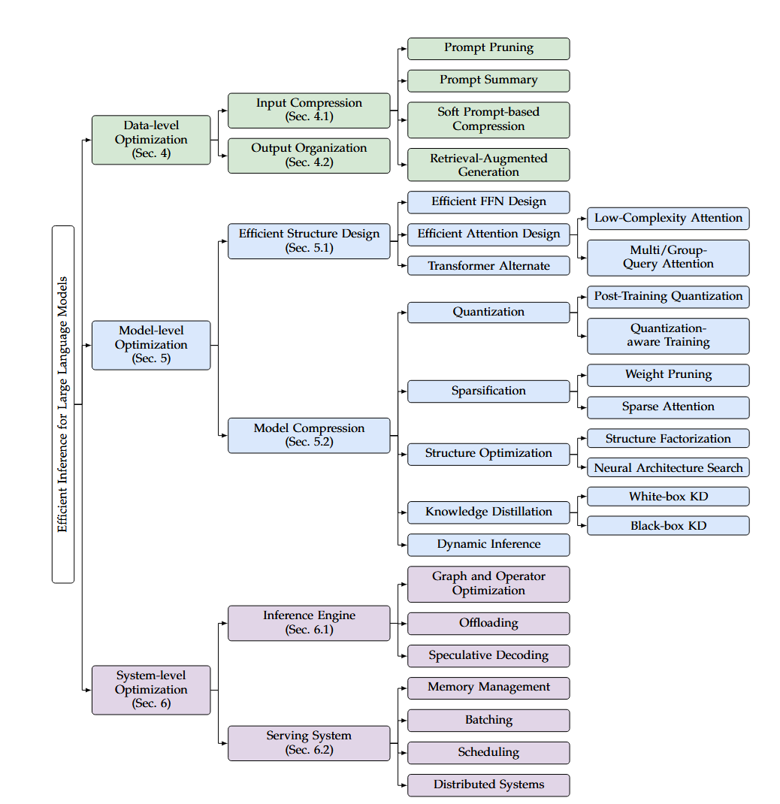
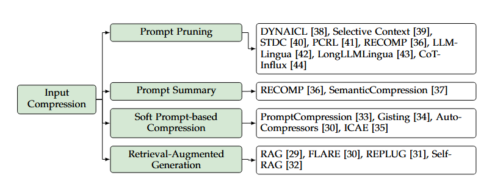
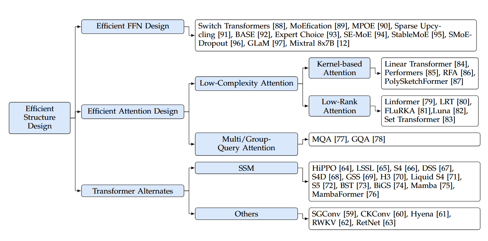
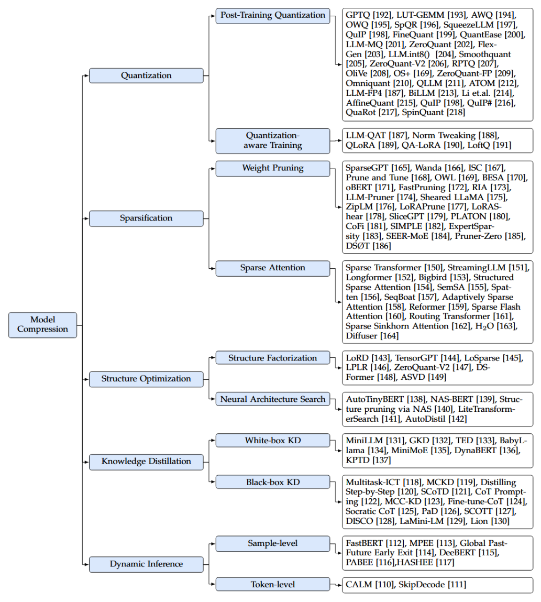
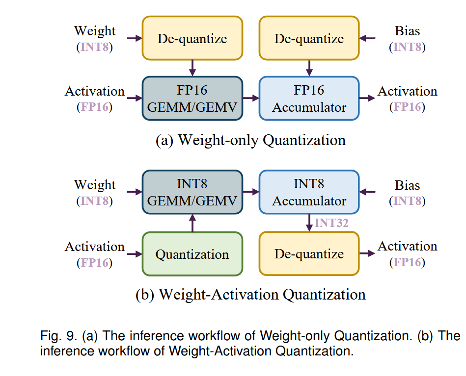
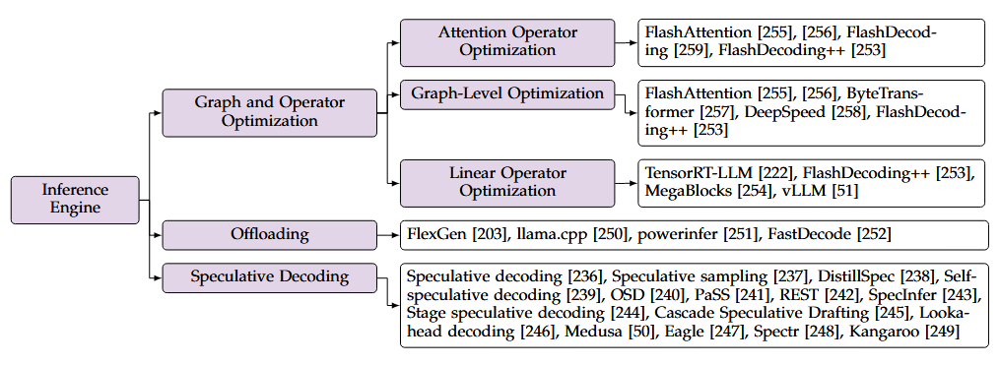
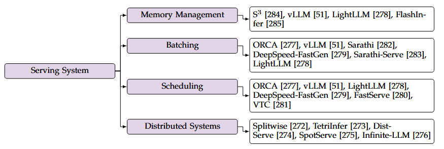
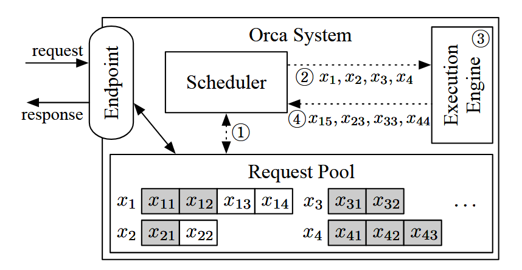

>   调研学习现在主流的推理服务系统，比如vLLM、SGLang等，包括他们的系统框架实现，调整不同模型、不同序列长度等做性能对比测试，汇总实验结果

# A Survey on Efficient Inference for Large Language Models

[论文地址](https://arxiv.org/abs/2404.14294)

## Data-Level

### Input Compression

ICL, In-Context Learning，给出问答示例，与 CoT, Chain-of-Thought 都会在释放 LLM 的能力的同时让 prompt 变长，所以就提出了 输入压缩 Input Compression

#### Prompt Pruning

保持未被剪枝的部分，去掉部分 token

-   DYNAICL 动态决定 上下文例子数量

-   Selective Context，合并 token，再剪枝unit（按自信息指标）

-   STDC，解析树parse tree，依次删除性能降低最小的词组

-   PCRL，token-level 剪枝策略 RL（可信率，压缩前后相似度 和 压缩率）

-   RECOMP，sentence-level 剪枝，对RALM（Retrieval-Augmented 检索增强），根据与问题的latent embedding相似度，去删除docu

-   『Mark』**(Long)LLMLingua**，用小的语言模型把prompt转化成人类难理解但LLM好理解的形式，实现压缩，还有工程上的粒度粗到细等（大概是因为他能还原回原来）

    稍微进一步了解了一下，想法来源有 [Semantic Compression With Large Language Models](https://link.zhihu.com/?target=http%3A//arxiv.org/abs/2304.12512) 和 [Selective-Context](https://link.zhihu.com/?target=http%3A//arxiv.org/abs/2304.12102) 。

-   CoT-Influx，也是粗到细coarse-to-grained 剪枝，对CoT示例剪枝，开始的CoT示例长。

#### Prompt Summary

总结，写一篇新的总结

-   RECOMP，总结
-   SemanticCompression，文本到句子，句子组按组总结

#### Soft Prompt-based Compression

可学习的、更短的prompt

（离线）

-   PromptCompression，可学习的、更短的prompt
-   『Mark』Gist，修改attention mask，添加gist token，mask屏蔽之后，模型被迫把prompt的内容压缩在gist token中

（在线）

-   AutoCompressors，用无监督的方法，训练LM去压缩prompt成summary vectors
-   『Mark』ICAE，可学习的编码器LoRA，编码到memory slots

#### Retrieval-Augmented Generation, RAG

RAG检索增强，只把大量数据中的和目标相关的检索内容装入原始prompt

-   『？』FLARE，对将来的句子预测什么时候、哪些信息需要去检索
-   『？』REPLUG，用可调的检索模型增强
-   『？』Self-RAG，reflection反思tokens，使得输出可控

### Output Optimization

传统输出过程是串行的，OO目标是组织输出结构，使得部分并行

-   『Mark』Skeleton-of-Thought, SoT，方向开创

    分为两个阶段，skeleton phase 骨架阶段和point-expanding phase 点扩展阶段

    第一阶段，用 **skeleton prompt** 生成简明的骨架

    第二阶段，用 **point-expanding prompt** 同时对每一个 skeleton 点进行扩展

    比如先举例名词，再补充具体描述

    可以用 **batch inference** 加速，提高硬件利用率，降低生成延迟。

    同时，可以用**shared prompt**来降低额外开销，同时再使用 **router model**决定是否使用 SoT，因为不是所有任务都适合 SoT

    结果上，加速了又提高了结果质量，应用场景应该在个人设备，跑满个人设备。

-   SGD（原版名字），在SoT的基础上，改成 DAG 生成图，同时增加严格独立性假设，提升答案质量，同时对不同点使用合适大小的模型输出结果

-   『Mark』APAR，与SoT相似，结合 **Medusa** 和 **vLLM** 等。

-   『Mark』SGLang，自动分析生成调用的依赖关系，去batch inference和kv cache sharing，同时结合 **SoT**, **ToT**

### Knowledge, Suggestions and Future Direction

『Mark』更高效的 agent 架构，**FrugalGPT**，主要是LLM cascade级联，选择合适的大小

和模型级的动态推理不一样，这个是流程级的。

## Model-Level

### Efficient Structure Design

#### Efficient FFN Design

『Mark』Mixture-of-Experts (MoE) ，对不同的输入token，动态分配不同的computational budgets

多个并行的FFN，即专家，需要和可训练的路由模型一起使用

主要是控制了模型参数变大的时候，控制计算量。

##### FFN expert construction

-   MoEfication，把 non-MoE 模型转化为 MoE 模型的方法，削除了 MoE 的昂贵训练

    把 FFN neurons 分组，组内同时激活，把每组重构成 expert

-   Sparse Upcycling，从dense model，初始化 MoE 的参数，具体地，就是dense的副本

    后续训练高效，易得到好的表现

-   MPOE，减少参数量，通过全局共享 + 局部辅助 张量，来减少参数量

##### design of routing model

路由模型不好的话，会导致负载不平衡问题，namely some experts 被分配了很多token，其他的很少

未完全利用模型能力、降低推理效率。

Switch transformers、Gshard、Tutel 等，常用 BMM batch matrix multiplication，同时计算所有的FFN expert，导致增加一个约束──**输入矩阵要是同一个shape**，未被很多用到的输入就需要padding到同一shape，就会产生计算浪费

-   Switch transformers，朴素的增加load balancing loss

    （但感觉如果这个loss很重的话，应该会导致expert之间的差异变小，算是trade off，感觉需要有MoE的激活情况，路由模型情况，latency, throughtout 和 parameter size, memory 的 tradeoff）

-   BASE，expert 学 embedding 表示，根据和 token 的相似度去分配 token

-   Expert Choice，固定expert 选top-k个token（embedding 相似度）

##### train method for MoE

-   SE-MoE，提出新的辅助loss，router z-loss，提高训练的稳定性

    softmax 的指数函数会加剧**舍入误差**，z-loss 惩罚 large logits

-   StableMoE，路由波动问题，（传统训练的时候，所以是怎么样的流程？）会被分配给不同的expert，推理的时候就确定的一个，训练和推理的策略不一致

    所以先学习路由策略，再确定下来这个路由策略，再训练，使得训练和推理的时候的路由是一致的。

    （简单有效，扩展的话就是交替训练几轮）

-   SMoE-Dropout，训练时，逐步增加激活的专家数，能训更大的参数

    （逐步增加激活数量，直觉上能让专家更能学成专家，scalability）

-   GLaM，说明MoE的scale up的表现和dense差不多的时候，训练、推理开销比dense少，是可以跟进的。

-   『Mark』Mixtral 8x7B，开源模型，每个token会分配给两个专家（推理时）

    （粗略看了看，专家都是全才专家吗（x），或者说同个token但是看得角度不同）

#### Efficient Attention Design

##### Multi-Query Attention (MQA, GQA)

同个位置，共享 KV，Q 还是独立的，GQA，head_kv \* head_dim 

##### Low-Complexity Attention

核函数转换后的点乘来近似代替softmax，具体的phi(Q) phi(K)^T，因为没有softmax了，先算 phi(K)^T 和 V，复杂度关于 n 就是一次的了。

-   Kernel-based Attention

    -   Linear Transformer，phi(x) = elu(x) + 1作为kernel
    -   Performers, RFA，random feature projection
    -   PolySketchFormer，polynomial functions + sketching tech

-   Low-Rank Attention

    利用注意力矩阵的低秩特性，先线性投影到 k x d，复杂度 NKD

    -   线性投影

        -   Linformer，首先注意力应用

        -   LRT，同时FFN中也应用

        -   FLuRKA，同时再用 kernelization

    -   其他

        -   『Mark』Luna，引入 P 矩阵，pack attention，unpack attention，改编了注意力的计算方式
        -   Set Transformer，引入 inducing points 类似的思路
        -   FunnelTransformer，用 pooling 池化，逐渐压缩长度

#### Transformer Alternates

##### State Space Model (SSM)

序列建模成递归转换，理论基础 HiPPO『Mark』

过渡矩阵 A

-   LSSL，先应用，用 HiPPO-LegS 初始化
-   S4, DSS, S4D，对角化 A，加速
-   S5，使用一组参数同时处理所有输入维度
-   Liquid S4 和 Mamba 输入依赖的参数化过渡矩阵
-   S5 和 Mamba 采用并行扫描，高效训练，不再用卷积

模型结构

-   GSS, BiGS 结合 GAU 与 SSM
-   BST，结合 Block Transformer 局部感知bias
-   H3，shift SSM，提升回忆早期token的能力
-   MambaFormer，把 Transformer 中的 FFN 换成 SSM Layer
-   Jamba，增加四层 Transformer Layer 到 SSM 模型中
-   DenseMamba，隐藏状态退化，引入密集链接，保持细粒度信息
-   BlackMamba和MoE-Mamba，SSM 和 MoE 结合

##### Other Alternates

长卷积或类似注意力的公式对序列建模

-   长卷积，Hyena，数据依赖参数化，浅层FFN

-   注意力类似，RWKV，建立在 AFT 的基础上（提出了代替attn的算子）

    RWKV 重新参数化了 AFT 的一些参数，并重写成递归形式

    使得其能够并行运算（Transformer）+高效推理（RNN）

##### Efficiency Analysis

训练并行性，卷积、注意力、Mamba并行扫描

推理，循环结构，使得长度无关，削除对cache、加载前面的token等需要

### Model Compression

#### Quantization

Prefilling stage 计算开销大， GEMM 高精度 CUDA Cores

Decoding stage 内存访问开销大，载入大权重 tensor，Weight-only Quantization

##### Post-Training Quantization

不再 retrain

Weight-Only Quantization，Quantizing both Weights and Activations，KV cache quantization。

Data Format Uniform or Non-uniform 是量化映射刻度平不平均

Quantization Parameter 确认方法

Quantized Value Update。

**weight-only quantization**

-   『Mark』GPTQ，LLM 量化的早期成果，基于传统量化 OBQ（对OBS的魔改，OBS由来自OBD）

    OBQ，行内根据原始的Hessian矩阵确认行内量化顺序，迭代调整未量化权重，计算补偿delta_q，Hessian 矩阵反复计算的复杂度高

    GPTQ，发现随机顺序效果也一样好，固定从左到右的顺序，重复利用海瑟矩阵的结果

-   『Mark』LUT-GEMM，提出反量化方式 Look-Up Table，降低反量化时的开销

    Binary-Coding Quantization (BCQ)，可学习的量化间隔

    （之前好像是在 flashinfer 代码中也见到过 LUT）

-   『Mark』AWQ，会更加保护少数的最重要的weight channel

-   OWQ，对激活值的异常值，混合精度量化策略，对重要的采用高精度，不重要的低精度

-   SpQR，权重异常值隔离处理量化，非异常的量化到3bit

-   SqueezeLLM，异常值用全精度稀疏矩阵，并且用非均匀量化

-   QuIP，LDLQ，二次代理目标

-   FineQuant，启发式的方法并结合实验经验，确定column量化粒度

-   QuantEase，基于GPTQ，用 Coordinate Descent 来提高精度，同时可以利用 GPTQ 的量化值来进一步提升

-   LLM-MQ，Compressed Sparse Row (CSR) 存储异常值，层的位宽分配建模为整数规划，设计了高效Kernel反量化，降低了内存访问成本

-   AffineQuant，等效仿射变换，降低量化误差

-   Quip、Quip#、QuaRot（）、SpinQuant（在验证集中找 optimal 旋转矩阵） 通过计算不变性，旋转矩阵给权重、激活值矩阵，降低异常值

**Weight-Activation Quantization**

-   ZeroQuant，细粒度量化（权重组量化、激活值token量化），算子融合，逐层知识蒸馏恢复性能

-   FlexGen，量化 weight, KV cache，INT4

-   LLM.int8()，激活值的异常值只有小部分channel，把激活值与权重分成两部分

-   SmoothQuant，引入缩放因子，平衡权重与激活值的值，降低量化精度

-   ZeroQuantV2，LoRC (Low-Rank Compensation)，用低秩矩阵降低量化误差

-   RPTQ，不同激活值通道的分布差异大，重新组织簇cluster，分别簇内量化

-   OliVe，牺牲普通值的精度，让量化的时候更关心异常值

-   OS+，异常值分布集中、不对称，通道偏移和缩放

-   ZeroQuant-FP，发现 W4A8，用 FP4, FP8 比整数更好

-   Omniquant，优化权重裁剪边界和缩放参数，等效转换，减小量化误差

-   QLLM，通道重组，可学习的低秩参数

-   Atom，混合精度、动态量化，量化KV cache INT4，提高吞吐量

-   LLM-FP4，预偏移指数偏差，结合激活值的缩放参数和权重

-   BiLLM，权重的钟型分布和权重的海瑟矩阵的长尾分布，基于海瑟矩阵，权重分类重要和不重要

    二值化，1.08bit 的量化

-   KVQuant，通过校准calibration集，对KV cache非均匀量化

-   KIVI，per-channel K, per-token V，分组

『Mark』Evaluating Quantized Large Language Models，多个LLM-Quant的实验评估

##### Quantization-Aware Training

**减少数据需求**

-   LLM-QAT，无须额外数据，用分词表每个词元token起始生成句子，蒸馏训练量化LLM
-   Norm Tweaking，将起始词元token限制为最高比例语言的类别

**减少计算成本**

parameter-efficient tuning (PEFT)

-   QLoRA，把LLM权重 INT4 量化，再用 LoRA BF16 对每个 INT4 权重矩阵微调
-   QA-LoRA，观察到 QLoRA 量化参数和低秩适应器不平衡，分组量化，增加量化参数，同时支持将 LoRA 合并到对应矩阵中
-   LoftQ，QLoRA 从0初始化 LoRA 对下游任务不高效，提出用SVD奇异值分解（量化前后的差值的）初始化
-   Norm Tweaking，量化后再训练 LN，知识蒸馏匹配分布

##### Comparative Experiments and Analysis

Weight-Only Quantization 

1.   加速解码阶段，通过提升从 HBM 的加载数据的速度
2.   预填充阶段，实际可能会提高延迟，因为瓶颈在于计算开销，而非内存加载，还要增加反量化的开销
3.   随着 batch-size, input-length 提高，加速比降低，因为随着更大，计算的开销占比变大，同时WOQ降低了内存访问开销，计算开销就会更重要
4.   WOQ 对更大的模型收益更大

#### Sparsification

目的是降低**计算复杂度**和**内存占用**

##### Weight Pruning

**非结构化剪枝**

细粒度，更高程度的稀疏化，缺少高层次的规整性，不规整的内存访问和计算模式，硬件加速有限

剪枝标准，**权重重要性**和**剪枝率**；对很大的参数规模来说，**剪枝效率**也关键

基于重构损失的剪枝标准

-   SparseGPT，遵循 OBS (Optimal Brain Surgeon) 思想，考虑重构损失，采用最优部分更新 OPU 提高效率，设计了自适应掩码
-   Prune and Tune，基于SparseGPT，在剪枝过程中用最小步骤来微调
-   ISC，结合 OBS 和 OBD 的设计了新的剪枝标准，根据 Hessian 信息来分配非均匀的剪枝率
-   oBERT 和 FastPruning，利用损失函数的二阶信息来决定被剪枝的权重对象
-   BESA，重构损失的梯度下降，学习可微二元掩码，每层剪枝率由最小重构误差顺序决定

基于量级magnitude的剪枝标准

-   Wanda，权重幅值与激活值范数逐元素点积作为标准

-   RIA (Relative Importance and Activations)，用连接的权重来评价该权重的重要性

    将非结构化的模式，转化为结构化的N:M稀疏结构，在GPU上加速

其他剪枝标准和方法

-   Pruner-Zero，自动识别LLM的最优剪枝度量，定制

-   OWL，根据激活值的离群值比例分配每层的剪枝率

-   DSØT，免训练的微调剪枝大模型的方式，

    『Mark』pruning-and-growing（Dynamic Sparse Training 中用的），先剪枝，再迭代调整网络拓扑结构

**结构化剪枝**

粗粒度，推理加速在传统硬件上

-   LLM-Prunner，根据连接关系判别耦合结构，再设计 组剪枝度量 决定剪枝，再可以通过LoRA等方式恢复性能
-   Sheared LLaMA，把原始的 LLM 剪枝成现存的预训练LLM，又设计了动态批量加载
-   ZipLM，迭代识别并剪枝结构化组件，权衡损失和运行时间
-   LoRAPrune，设计LoRA指导的剪枝标准，用LoRA的权重和梯度，迭代剪枝
-   LoRAShear，LoRA-based LLM，图论算法确定最小移出结构，结构性剪枝算法LHSPG，动态知识恢复
-   SliceGPT，RMSNorm 的计算不变性
-   PLATON，同时考虑权重的重要性（指数移动平均（EMA））和不确定性（上置信界（UCB））
-   CoFi 和 SIMPLE，学习相应的稀疏掩码来剪枝，再知识蒸馏
-   MoE 的专家剪枝
    -   ExpertSparsity，剪枝FFN，Frobenius范数量化，原始输出与剪枝层输出
    -   SEER-MOE，校准数据集上激活次数来量化重要性

##### Sparse Attention

MHSA，提高计算效率

**静态稀疏注意力**

常见稀疏模式

-   局部注意力，固定大小窗口注意力
-   全局注意力，减少解码阶段的内存访问成本和内存使用
-   随机注意力
-   扩张滑动窗口模式

-   Sparse Transformer，局部模式捕获局部上下文，然后每隔几个词使用全局模式聚合信息
-   StreamingLLM，应用局部模式，保留初始几个的注意力，attention sink
-   BigBird，局部、全局和随机模式的组合证明可封装所有连续序列，图灵完备性
-   LongFormer，扩张滑动窗口模式
-   Structured Sparse Attention，熵感知训练方法，让高概率的注意力更聚集，适应稀疏
-   SemSA，梯度的分析来识别重要的注意力模式，自动优化注意力密度分布

**动态稀疏注意力**

Dynamic Token Pruning

-   Spatten，注意力矩阵的列去评估重要性
-   SeqBoat，训练 SSM 决定head剪枝哪些词元
-   Adaptively Sparse Attention，生成过程中剪枝，对丢弃对未来不重要的上下文

Dynamic Attention Pruning

-   Bucket-based
    -   Reformer，局部敏感哈希，将哈希相同的k-v聚类到同一个桶
    -   Sparse Flash Attention，为hash-based稀疏注意力引入优化kernel
    -   Routing Transformer，球面k均值聚类，优化选择过程
    -   Sparse Sinkhorn Attention，排序网络，对齐 k 和 q buckets，只做对应的运算
-   H2O，词元级别，静态局部注意力与当前查询和动态识别的关键词元的动态运算，生成中移除最不重要键的

图论

-   每个词元视为图节点，原始完全注意力等同完全图，随机掩码的稀疏注意力等同于任意两点距离 log n
-   『Mark』Diffuser，图论的视角，多跳词元相关性扩展感受野，扩展图，设计近似注意力信息流

#### Stucture Optimization

平衡模型效率和表现

##### Neural Architecture Search

-   AutoTinyBERT，one-shot NAS，找Transformer的超参数，引入批量训练方法训练SuperPLM，进化算法来识别最优的子模型
-   NAS-BERT，分块搜索、搜索空间剪枝和性能近似等技术，有效地应用于各种下游任务，无须大量重训练
-   NAS，结构性剪枝
-   LiteTransformerSearch，免训练的指标，如参数数量
-   AutoDistil，搜索空间划分、任务不可知的SuperLM训练和任务不可知的搜索，促进各种跨任务的架构搜索

##### Low Rank Factorization

用两个低秩矩阵来近似，减少内存使用并提高计算效率，因为内存访问成本是解码速度的瓶颈，LRF减少需要加载的参数数量

-   LoRD，用奇异值分解 (SVD) 来分解权重矩阵
-   TensorGPT，张量训练分解 (Tensor-Train Decomposition)压缩嵌入层，token视为矩阵乘积态 (MPS)，提高分布式计算效率
-   LoSparse，LRF和权重剪枝，减轻直接模型剪枝通常会发生的丢失过多表达性神经元的风险
-   LPLR 和 ZeroQuant-V2，同时应用LRF和量化来压缩权重矩阵
-   DSFormer，权重矩阵分解为一个半结构化稀疏矩阵和一个小密集矩阵的乘积
-   ASVD，激活感知的SVD，根据激活分布缩放权重矩阵，搜索过程确定每层的适当截断秩
-   SVD-LLM，截断感知的白化技术识别移出后影响最小的奇异值

#### Knowledge Distillation

可以接触到结构与参数，中间的特征与输出logits

##### White-box KD.

-   MiniLLM，标准白盒KD，但用 reverse KLD 代替 KL
-   GKD，引入策略数据，包括学生模型的输出，进一步对齐师生模型
-   『？』TED，任务感知的逐层KD，每一层后加filter，固定教师filter训练学生，效果上是把和下游任务相关的KD出来
-   MiniMoE，用MoE作为学生模型
-   DynaBERT，逐步减少模型宽度、深度
-   KPTD，基于实体定义生成一个迁移集

##### Black-box KD.

教师模型的结构和参数不可用的KD

**上下文学习 (ICL) 能力蒸馏**

-   『Mark』Multitask-ICT，引入了上下文学习蒸馏，转移 few-shot 的能力
-   『Mark』MCKD，多阶段蒸馏范式

**思维链 (CoT) 推理能力蒸馏**

-   Distilling Step-by-Step, SCOTD, CoT Prompting, MCC-KD 和 Fine-tune-CoT，结合回答与原因来训练

-   Socratic CoT，推理能力迁移，微调一对模型，问题生成QG与问题回答QA

    QG被训练来根据输入问题生成中间问题，QA生成最终回答

-   PaD，根据错误的推理信息有害，额外增加解释器检查，移出含错误推理的蒸馏数据

**指令遵循 (IF) 能力蒸馏**

-   DISCO，使用LLM生成短语扰动，然后由教师模型过滤，蒸馏
-   LaMini-LM，设计一个多样化的指令集，转移指令能力
-   Lion，教师模型识别困难的指令，并生成新的复杂指令给学生模型

#### Dynamic Inference

和 MoE 不同，DI 是提前退出

##### Sample-level.

-   FastBERT, DeeBERT, MP 和 MPEE，根据特征训练退出分类器
-   Global Past-Future Early Exit，用前后层的信息来丰富模块输入
-   PABEE，训练成预测的输出头
-   HASHEE，无参数判断，相似样本，相同层退出

##### Token-level.

-   CALM，Transformer层之后退出分类器，缺失的 KV cache，直接复制退出层的特征，性能下降轻微

-   SkipDecode，提前退出会导致批量推理和KV cache的局限，限制实际的加速

    提出统一的退出点，退出点单调递减，使得KV cache不用重算

### Knowledge, Suggestions and Future Direction

-   non-Transformer 架构，Mamba，RWKV 以及变体

-   模型压缩，量化是主要方法，应用方便，大量减少内存消耗与提高推理速度，对应于很小的性能降低

    但可能会损害如自我纠正、多步推理等能力

    比如长上下文场景，可能就会有较大影响了

-   对高效长上下文，稀疏注意力是主要研究技术

    但是丢失掉重要信息的话，对性能影响很大，即使稀疏度不高

    所以，模型权重剪枝仍然关键

-   模型结构优化，NAS，但需要大量的计算资源

    自动优化可行性仍在探索

    LRF等技术在压缩率与性能之间的权衡

## System-Level

### Inference Engine

#### Graph and Operator Optimization

##### Attention Operator Optimization

-   『Mark』FlashAttention，缓解内存访问等开销

    融合成单独一个算子，缓解内存访问开销，注意力矩阵分成多个块，消除完整载入的需要

-   『Mark』FlashDecoding，最大化decoding阶段的计算并行

    decoding阶段，Q矩阵是batch of vectors

    并行度如果是 Batch size 维度会受限，他以**序列维度来并行**

    虽然引入了在softmax阶段的同步开销，提升依旧明显，特别是batch小，seq大的时候

-   『Mark』FlashDecoding++，之前的工作的最大值只作为防止溢出的作用，但动态最大值也带来了很大的同步开销

    大量实验证明，softmax的输入落在特定的范围

    提出提前确定缩放因子，消除了softmax的同步开销

##### Linear Operator Optimization

-   TensorRT-LLM，引入 General Matrix-Vector Multiplication (GEMV)

-   FlashDecoding++，引入FlatGEMM概念，表示维度缩减的GEMM ( < 8)

    低并行度（细粒度分块策略）、内存访问瓶颈（双缓冲技术）

    观察到线性算子在特定的LLM常常形状一致，提出启发式的选择策略

    根据输入的形状，选用 FastGEMV, FlatGEMM, GEMM (cuBLAS)

-   『Mark』MegaBlocks，首先去优化 MoE FFN 的，linear operator 可以占据九成

    提出的定制 GPU Kernel 主要对于训练阶段，对推理阶段没有

    vLLM 目前集成 Triton 的 fused kernel，削除索引开销

##### Graph-Level Optimization

Kernel fusion 为代表，降低内存访问，kernel启动开销，增加并行度

-   FlashAttention，将注意力算子融合成一个内核（注意力算子的 memory-bounded 的）

-   ByteTransformer 和 DeepSpeed，融合轻量级算子，残差添加、层归一化和激活函数等融合到前面的线性算子中

    减少 kernel launch 开销

-   对 LLM 推理来说，QKV 投影融合到一个线性算子中，

#### Speculative Decoding

小模型作为草稿模型，目标模型作为验证模型

草稿构建，草稿验证，接受率是关键指标，确保输出与自回归（贪婪采样 概率最高，或核采样 按概率）等效

因为核采样多样性，用 speculative sampling 保持输出分布，生成按概率接受

变体 token tree verifier，树状表示，树注意力机制做高效验证

接受率与两者输出的分布直接相关

-   DistillSpec，从目标LLM直接蒸馏小的草稿模型

-   SSD (Self-speculative Decoding)，自动识别目标模型的子模块，无需单独训练草稿模型

-   『Mark』OSD (Online Speculative Decoding)，动态调整草稿模型的输出分布以匹配用户查询分布

    用拒绝的草稿词元来微调模型

-   『Mark』PaSS，目标LLM本身作为草稿模型，在输入序列中加入可训练的“前瞻词元”

-   REST，基于检索，使用非参数检索数据存储作为草稿模型

-   『Mark』SpecInfer，用 boost-tuning 使得一组的草稿模型的输出和目标LLM对齐

-   Lookahead decoding，生成 n-grams，辅助生成草稿词元

-   『Mark』Medusa，微调一些注意力头来生成 draft token

-   Eagle，轻量级Transformer层以自回归方式生成草稿词元，输入结合丰富的目标LLM的上下文

-   Kangaroo，用固定浅层子网络作为draft model，训练轻量适应器，不用额外训另一个draft model

**草稿构建策略**

传统方式只有一个候选序列，如果有一个token是不满足的，后续都会被放弃，验证通过率低

-   『Mark』Spectr 和 SpecInfer，生成多个草稿词元序列，同时用 token tree verifier 验证
-   Stage Speculative Decoding 和 Cascade Speculative Drafting (CS Drafting)，推测解码集成到词元生成过程中，加速草稿构建

**Comparative Experiments and Analysis**

-   Eagle 加速明显
    1.   自回归生成 draft token 可以利用前面的生成的 token
    2.   从先前的目标 LLM 和 草稿模型的 token，集成了丰富的特征
-   token tree verifier 高效推测解码
-   端到端加速比低于接受率，生成草稿的代价不可忽视

#### Offloading

-   FlexGen支持卸载权重、激活和KV缓存，并将卸载问题公式化为图遍历问题以最大化吞吐量 。

    下一批数据的加载和前一批数据的存储可以与当前批的计算重叠 。

-   llama.cpp，也将计算任务分配给CPU，以低功耗CPU的计算成本为代价减轻数据传输开销 。

-   Powerinfer，利用LLM中ReLU激活的稀疏性，将激活分为冷热神经元子集

    冷神经元被卸载到CPU进行存储和计算

    利用自适应预测器和稀疏算子显著提高了带卸载的计算效率

-   FastDecode，将整个注意力算子的存储和计算卸载到CPU

    因为在 CPU 上运算，KV cache 的数据移动减少到仅一些激活值，CPU数量以匹配GPU上的工作负载延迟，减小异构流水线气泡

### Serving System

提高异步请求效率

内存管理，容纳更多请求，批处理和调度策略以增强系统吞吐量，分布式计算资源

#### Memory Management

生成长度不定，kv cache 分配

-   早期实现，预设最大长度；若结束的早，造成存储资源浪费

-   S3，预测每个请求的上限，减少浪费，但如果不存在这么大的连续空间，静态分配会失败

-   『Mark』vLLM，解决碎片化存储，提出页式存储管理，先申请尽可能大的内存，然后再等分成若干个物理块

    对请求动态映射预申请的物理块，提高了吞吐量

-   LightLLM，基于vLLM，更细粒度的存储，减少由于不规则的浪费，把一个token作为一个单元

这种 paged 但是会导致注意力算子的不规则内存访问，为了高效注意力算子，需要定制kv cache的访问方式，来连续内存访问

vLLM 的 PagedAttn K缓存的头大小维度存储为16字节连续向量，FlashInfer 编排了不同的数据布局

#### Continuous Batching

一个批次的请求长度不同，长度短的结束早

由于服务场景的请求异步性，CB 一些旧请求完成后立即批处理新请求

-   『Mark』ORCA，首次 LLM 中用连续批处理

    不同请求在 iteration-level batching，在线性算子，序列维度连接

-   vLLM，拓展到注意力算子，不同 kv cache 长度

-   Sarathi, DeepSpeed-FastGen 和 SarathiServe，LightLLM，**split-and-fuse**，把 prefill 与 decoding 一起批处理

    序列维度上分割长的 prefill，和多个短的 decode 放一起，平衡不同迭代的负载

    消除新请求的停顿

    split-and-fuse，前提是 prefill 可以被分成离散块

-   Chunked-prefill，利用自回归特性，有数学等价性，减少请求延迟

#### Scheduling Strategy

请求执行顺序影响吞吐量，head-of-line blocking，第一个请求很大，包括对内存的占用

-   ORCA, vLLM, LightLLM，first-come-first-serve (FCFS)

-   DeepSpeed-FastGen，优先处理解码请求

-   FastServe，preemptive scheduling 抢占式调度，实现低 JCT 作业完成时间

    multi-level feedback queue (MLFQ) 多级反馈序列，优先剩余时间最少的

    因为 decoding 长度未知，预测长度，skip-join 找到适合的优先级

-   VTC，LLM 服务的公平性，基于 token 数量的 cost，确保公平性

#### Distributed Systems

增加吞吐量

-   splitwise, TetriInfer 和 DistServe，解耦 request 的 prefill 和 decode，能够按照对应特性各自处理
-   ExeGPT 和 Llumnix，实时排序，负载均衡、碎片整理和优先级排序
-   SpotServe，云上可抢占GPU式的服务，解决动态并行控制、实例迁移、token-level state recovery
-   『？』Infinite-LLM，跨数据中心并行化注意力算子中序列的不同部分
-   LoongServe，弹性序列并行性，管理迭代级别的弹性资源，调度减少 kv cache 移动

### Hardware Accelerator Design

-   FACT，混合精度量化，算法-硬件协同设计，但没有针对LLM设计

-   ALLO，FPGA 在内存密集的 decode 阶段的优势，强调模型压缩对 LLM 在 FPGA 上的部署的重要性

    高级综合库 HLS

-   DFX，decoding 优化，缺乏模型压缩，限制了模型参数、长输入

-   FlightLLM，可配置的稀疏数字信号处理 DSP 链

    混合精度支持的 always-on-chip decode 方案

### Comparison of LLM Frameworks

### Knowledge, Suggestions and Future Direction

算子优化和服务场景结合紧密，算子优化会因需求场景而特殊设计

长度不确定，常用预测，但是目前预测效果一般

# Towards Efficient Generative Large Language Model Serving: A Survey from Algorithms to Systems

[论文地址](https://arxiv.org/abs/2312.15234)

# Orca: A Distributed Serving System for Transformer-Based Generative Models

[论文地址](https://www.usenix.org/system/files/osdi22-yu.pdf)

Continuous Batch

## 动机与贡献

1.   Early-finished and late-joining requests

     -   问题：

         现有的推理服务系统以 request 为粒度调度，一个批次完整结束才能处理后面的 request。

         较短生成的 request 要等较长生成的 request。

         （展示了request 同 input 长度，如果 input 长度不同是什么样的？）

         训练不存在这个问题，因为用 Teacher Forcing technique，只要一次迭代就完成了

     -   解决方案：Iteration-level scheduling

         调度粒度 iteration-level，调度器获得控制在一次迭代中，多少、哪些请求被处理

         暴露一个 endpoint 终端节点，来接受请求和返回回答

         用 Request Pool 来管理所有的请求

         Scheduler 来选择 request set，调用 Execution Engine，接受运行结果，用运行结果更新 Request Pool

         

2.   Batching an arbitrary set of requests

     -   问题：

         initiation phase 开始阶段，token 数量不同不能 batching

         increment phase 增量阶段，不同索引（kv cache）不能 batching

         不同阶段不能 batching（开始阶段输入所有 input token，增量阶段输入一个 token）

         

         batching 条件苛刻，实际情况的负载难以符合，长度越长，越难

         （传统的批处理具体是怎么样的？一个 batch 里面分别访问各自的 kv cache，长短不一 padding 代码实现方式）

     -   解决方案：Selective batching

         不选择对所有算子使用 batching 处理

         不能 batching 的原因是输入的形状不规则，但是不是所有的算子都不能适配不规则的算子

         比如 Linear, LayerNorm, Add, and GeLU

         selective 指对算子的选择，分为可接受输入形状不规则和不可接受

         注意力算子，是采用 Split、单独计算、Merge 的方式，用 Attention K/V Manager 为每个请求单独管理 kv cache

         

## Orca Design

-   分布式结构

    要支持 scale up 的参数，需要考虑分布式结构的设计

    intra-layer 和 inter-layer 并行（最初用于训练的技术）

    把CPU-GPU的**控制信息**和**数据信息**分开传输，数据信息使用 NCCL，GPU-GPU 传输，gRPC 是 CPU-CPU传输

    之前的分布式推理，控制信息和数据信息一起传 CPU1 => GPU1 => GPU2 =等待=> CPU2

    会出现 CPU-GPU 同步开销，而且每一次迭代都有，那就不可忽视，分开传输后，消除了这部分气泡

    让 GPU 尽可能工作

-   调度算法

    调度器每次迭代都会决策

    ORCA 的策略是 FCFS 先到先服务

    考量因素：

    1.   以**延迟增加**为代价，为**吞吐量**增加**批次大小**；当**批次大小**过大后，**吞吐量**会减小，需要设置好**批次大小**

    2.   GPU 内存限制，通过**重用 buffer 缓冲**的方式优化内存使用，但在注意力 kv cache 的重用中，只有当请求结束才会释放整个的缓冲，如果实现过于朴素，会因为没有足够内存而形成**死锁**，需要设置好**预留内存**

         具体地，用请求中的 max_token 去累加预留内存

    对于外部的请求接受与返回，会有并发线程去插入或删除 request_pool 请求池内的请求

从流水并行上比较，ORCA 的方式为流水并行无需额外代价，FasterTransformer 的方式，需要用微批次来权衡流水并行度，同时可能会产生气泡，而微批次又会损害批处理的表现。

## 实现与实验

gRPC - control plane, NCCL - data plane

fused kernel，包括 split Attn（虽然因为运行时间不一致，但是总的来说提高了 GPU 的利用率，同时减小内核启动开销）

（为什么 inter- 和 intra- 结合？intra- **通信成本**高；**扩展性**有限，如注意力层，不能超过注意力头）

测试场景，因为本文提出两大方面的改进，分布式架构的控制信息与数据信息的分离，是单独对 execution engine 影响的，所以设计了单独 ORCA engine 和 end-to-end 场景的实验。

具体地，在 Orca engine  基准测试中，一直给定相同的 batch 来模拟 request-level 的调度

端到端测试中，没有真实的 request 模型和数据，无法知道正确的中断位置，设置不产生 \<EOS\>，生成到 max_token

模型，只是因为当时没有合适的开源大模型，他们就根据 GPT3 公布的结构来模拟搭了一个，没有训练，只有结构

（所以，会不会存在参数设置，然后产生一些优化？不过因为基准测试用的是同一个模型，应该影响不大）

数据，人工合成符合统计分布的数据：输入输出长度，随机抽样；到达实现 Possion泊松分布，同时调整参数，来表示不同的负载情况。

（现在有 publicly-available request trace for generative language models 的数据了么？不过为了能更加好的定量测量比较可能还是会去设置固定的生成长度什么的吧

**ShareGPT** and **Alpaca** datasets，not include timestamps）

注意力操作选用狭义定义，**缩放点积注意力（scaled dot-product attention）**部分，即 `softmax(Q @ K.T) @ V`，是激活值之间。

没有 batching reuse 参数，影响不大，因为没有参数

作者通过精细的设计实验，使得每一模块的设计，都能去单独比较。

Orca Engine（排除调度优化）

>   层内并行的 GPU，控制信息会一次分发到，因为他们本身就要一起工作，层间并行对 GPU，因为会等上一层的结果，如果不用 gRPC 来传递控制信息，用 NCCL 传递，就会有 CPU-GPU 同步的问题

小模型（排除 gPRC 控制信息优化）

由于不是所有的算子都去 batching，所以执行时间会高一点点，因为（狭义）注意力算子没有参数重用，影响不大。

但是 batch size 大小上，Orca 能支持的大小更大，因为 FasterTransformer 固定了 max_token，而 Orca 可以根据每个请求各自的 max_token 来设置预留空间，支持更多的场景，扩展性更好。

大模型（考虑 gPRC 控制信息优化）

（禁用流水优化，因为 Iterative-level 的流水优化比 mircobatch 的方式，天然好，且不需要 tradeoff 微批次大小和并行性）

有层间并行，运行时间上明显下降，最好高比 FasterTransformer 好 47%

同时，更多层间，优化效率类似。

end-to-end（包括调度优化）

更改负载，画图（生成数据的参数）

对 FastTransformer 来说，直接批次比微批次性能更好，但是 BS 太大，会加剧 early-finished 和 late-joining requests 问题

## 相关工作

-   Fine-grained batching for recurrent models

    『Mark』BatchMaker (Low latency RNN inference with cellular batching)，以 RNN cell 为粒度来调度和批次

    每次 RNN cell 执行的是一样的运算，而 Transformer 要复杂得多，且没有对大模型和流水线并行的支持

-   相比之前的运行引擎，大多数只是作为后端，并且还没有很多支持分布运行的

-   相比之前的服务系统，往往和运行引擎是非耦合的，Orca 耦合度增加，包括更频繁的交互，管理内存，一体化等。

## 总结

从现有的 request-level batching 不足出发，提出更加细粒度的调度 iteration-level。

在构想时，发现有些算子不能接受不规则的输入，用 selective batching 解决，注意力算子用 split-merge + fuse 处理。

具体地，为了能够支持大模型的运行，execution engine 使用分布式架构，同时对通信方式进行改进，

使用 gRPC 在 CPU 线程之间传输控制信息，NCCL 在 GPU 之间传输数据，消除了层间 NCCL 传输控制信息的 CPU-GPU 同步的气泡。

因为 serving system 和 execution engine 耦合的更深了，所以调度算法需要考虑的粒度也要更细。

## 优化思路

把 serving system 的调度粒度从 request 变成 iteration，tradeoff 了个别算子（注意力算子）的 batching 的效率，和 execution engine 的耦合度。

控制信息和数据信息，分开传输。

## 未来可能方向

保持低耦合的形式，细粒度的调度

定制注意力算子，支持不规则的 batching

自动找寻最后批次大小、并行参数

调整优先级，优化 FCFS，保证 fair 的基础上，进一步优化 batching 的对象

## 源码阅读

[他人复现](https://github.com/LLM-Systems-Research/orca)

（待）

# Efficient Memory Management for Large Language Model Serving with PagedAttention

[论文地址](https://arxiv.org/abs/2309.06180)

## 动机

KV Cache 在 LLM 中占比大，现在的 serving system 的内存管理会存在很多内部碎片、外部碎片，内存浪费，不能充分利用内存去做 batching。

现存系统不能很好的利用 memory sharing，共享前缀等。

## 贡献

-   由虚拟内存、分页技术启发，提出 PagedAttention，在逻辑上连续，物理存储上不连续的块上计算注意力
-   以 PagedAttention 为核心，设计实现了 vLLM，分布式服务引擎

## vLLM Design

-   PagedAttention 算子

-   KV Cache Manager，把逻辑连续的块，映射到物理不连续的块上，维护块表，使得不需要一次就申请所有位置的内存

-   多种场景的 decoding（Parallel sampling、Beam search、Shared prefix、Mixed...），引入 reference count，类似于操作系统的虚拟内存的 copy-on-write

-   调度，FCFS；由于没有关于生成长度的先验，边生成边申请，会遇到内存耗尽的情况。

    提出启发式的选择预计会访问最远的块放逐，同时考虑到 LLM 的特性，使用 **all-or-nothing** 的放逐策略，对于 Beam，采用 gang-schedule 一起放逐（同样是考虑到 LLM 的特性，要么全要用，要么全不用）

    停止接收请求，等到能放回来之后，把放逐的块完成了后，才继续接收（能够预留足够内存，防止 trashing 颠簸）

    具体放逐的方式（取决于内存带宽和计算效率，包括长度，优势不同）

    -   Swapping，换到 CPU 内存中
    -   Recomputation，重计算

-   分布式执行，为了避免 GPU worker 需要多次和 memory manager 同步，设计 centralized scheduler，GPU worker 之间 all-reduce

## 实现与实验

-   vLLM，FastAPI 前端，GPU-based 推理后端
-   实现很多为了加快块的读写、复制的 fused Kernel，**fused reshape and block write**, **fusing block read and attention**, **fused block copy**.
-   为了支持多种 decoding 算法，实现三种关键方法，**fork**, **append**, **free**

-   提出的方法和 Orca（continuous batching）是正交、互补的。
-   在越长、越复杂的 decoding 场景效率提升越明显

消融实验

-   Kernel Microbenchmark，新引入了块的概念，在访问 block table, block 读写开销等方面会引入延迟，具体地，基本只影响 attention 部分，开销不大
-   Block size 的选择，小浪费GPU并行资源，大浪费内部内存碎片
-   重计算和交换的比较

## 优化思路

引入 OS 的虚拟内存、页表的思想，管理 KV cache

## 未来可能方向

自动寻找最优块大小

动态选择重计算或交换内存

## 源码阅读

[vLLM](https://github.com/vllm-project/vllm)

[具体代码学习](vLLM.md)

# SGLang: Efficient Execution of Structured Language Model Programs

## 动机

## 贡献

## 总结

## 优化思路

## 未来可能方向

## 源码阅读

[SGLang](https://github.com/sgl-project/sglang)

[具体代码学习](SGLang.md)

# Fast Inference from Transformers via Speculative Decoding

[论文地址](https://arxiv.org/abs/2211.17192)

## 动机

## 贡献

## 总结

## 优化思路

## 未来可能方向

## 源码阅读

# DistServe: Disaggregating Prefill and Decoding for Goodput-optimized Large Language Model Serving

[论文地址](https://arxiv.org/abs/2401.09670)

## 动机

## 贡献

## 总结

## 优化思路

## 未来可能方向

## 源码阅读

