# A Survey on Efficient Inference for Large Language Models

[论文地址](https://arxiv.org/abs/2404.14294)

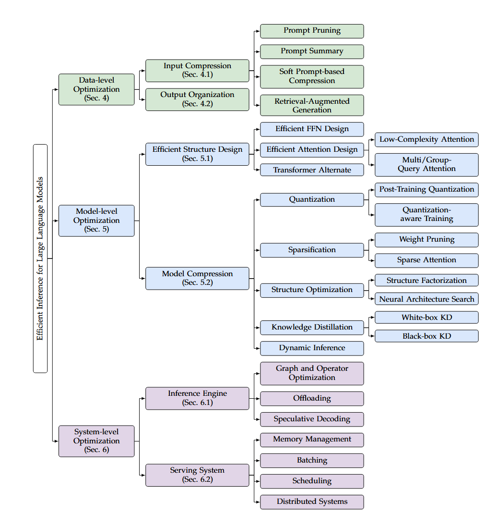

## Data-Level

### Input Compression

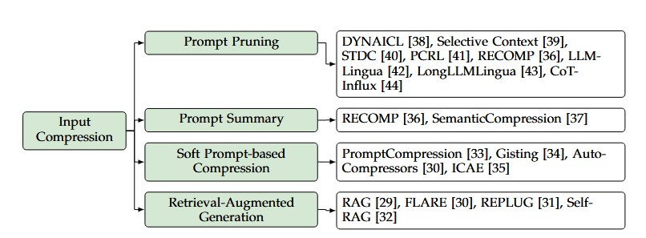

ICL, In-Context Learning，给出问答示例，与 CoT, Chain-of-Thought 都会在释放 LLM 的能力的同时让 prompt 变长，所以就提出了 输入压缩 Input Compression

#### Prompt Pruning

保持未被剪枝的部分，去掉部分 token

- DYNAICL 动态决定 上下文例子数量

- Selective Context，合并 token，再剪枝unit（按自信息指标）

- STDC，解析树parse tree，依次删除性能降低最小的词组

- PCRL，token-level 剪枝策略 RL（可信率，压缩前后相似度 和 压缩率）

- RECOMP，sentence-level 剪枝，对RALM（Retrieval-Augmented 检索增强），根据与问题的latent embedding相似度，去删除docu

- 『Mark』**(Long)LLMLingua**，用小的语言模型把prompt转化成人类难理解但LLM好理解的形式，实现压缩，还有工程上的粒度粗到细等（大概是因为他能还原回原来）

  稍微进一步了解了一下，想法来源有 [Semantic Compression With Large Language Models](https://link.zhihu.com/?target=http%3A//arxiv.org/abs/2304.12512) 和 [Selective-Context](https://link.zhihu.com/?target=http%3A//arxiv.org/abs/2304.12102) 。

- CoT-Influx，也是粗到细coarse-to-grained 剪枝，对CoT示例剪枝，开始的CoT示例长。

#### Prompt Summary

总结，写一篇新的总结

-   RECOMP，总结
-   SemanticCompression，文本到句子，句子组按组总结

#### Soft Prompt-based Compression

可学习的、更短的prompt

（离线）

-   PromptCompression，可学习的、更短的prompt
-   『Mark』Gist，修改attention mask，添加gist token，mask屏蔽之后，模型被迫把prompt的内容压缩在gist token中

（在线）

-   AutoCompressors，用无监督的方法，训练LM去压缩prompt成summary vectors
-   『Mark』ICAE，可学习的编码器LoRA，编码到memory slots

#### Retrieval-Augmented Generation, RAG

RAG检索增强，只把大量数据中的和目标相关的检索内容装入原始prompt

-   『？』FLARE，对将来的句子预测什么时候、哪些信息需要去检索
-   『？』REPLUG，用可调的检索模型增强
-   『？』Self-RAG，reflection反思tokens，使得输出可控

### Output Optimization

传统输出过程是串行的，OO目标是组织输出结构，使得部分并行

- 『Mark』Skeleton-of-Thought, SoT，方向开创

  分为两个阶段，skeleton phase 骨架阶段和point-expanding phase 点扩展阶段

  第一阶段，用 **skeleton prompt** 生成简明的骨架

  第二阶段，用 **point-expanding prompt** 同时对每一个 skeleton 点进行扩展

  比如先举例名词，再补充具体描述

  可以用 **batch inference** 加速，提高硬件利用率，降低生成延迟。

  同时，可以用**shared prompt**来降低额外开销，同时再使用 **router model**决定是否使用 SoT，因为不是所有任务都适合 SoT

  结果上，加速了又提高了结果质量，应用场景应该在个人设备，跑满个人设备。

- SGD（原版名字），在SoT的基础上，改成 DAG 生成图，同时增加严格独立性假设，提升答案质量，同时对不同点使用合适大小的模型输出结果

- 『Mark』APAR，与SoT相似，结合 **Medusa** 和 **vLLM** 等。

- 『Mark』SGLang，自动分析生成调用的依赖关系，去batch inference和kv cache sharing，同时结合 **SoT**, **ToT**

### Knowledge, Suggestions and Future Direction

『Mark』更高效的 agent 架构，**FrugalGPT**，主要是LLM cascade级联，选择合适的大小

和模型级的动态推理不一样，这个是流程级的。

## Model-Level

### Efficient Structure Design

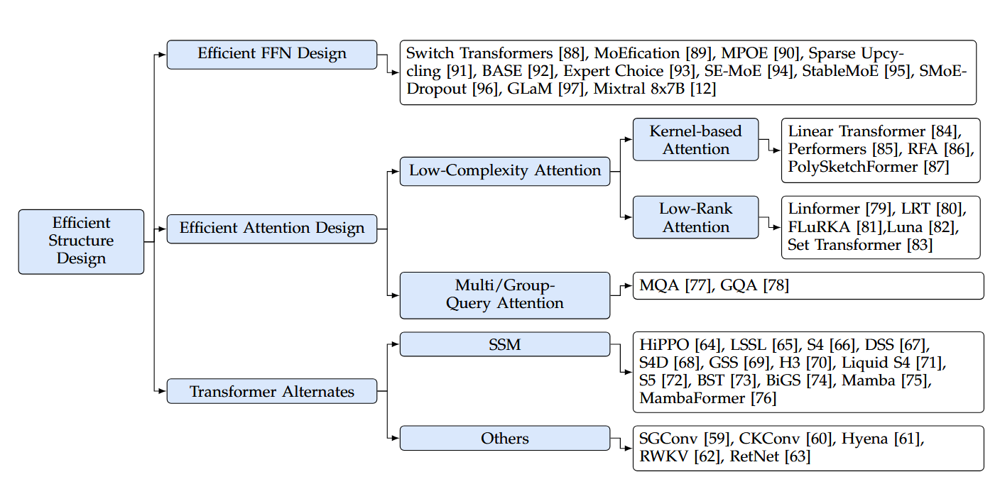

#### Efficient FFN Design

『Mark』Mixture-of-Experts (MoE) ，对不同的输入token，动态分配不同的computational budgets

多个并行的FFN，即专家，需要和可训练的路由模型一起使用

主要是控制了模型参数变大的时候，控制计算量。

##### FFN expert construction

- MoEfication，把 non-MoE 模型转化为 MoE 模型的方法，削除了 MoE 的昂贵训练

  把 FFN neurons 分组，组内同时激活，把每组重构成 expert

- Sparse Upcycling，从dense model，初始化 MoE 的参数，具体地，就是dense的副本

  后续训练高效，易得到好的表现

- MPOE，减少参数量，通过全局共享 + 局部辅助 张量，来减少参数量

##### design of routing model

路由模型不好的话，会导致负载不平衡问题，namely some experts 被分配了很多token，其他的很少

未完全利用模型能力、降低推理效率。

Switch transformers、Gshard、Tutel 等，常用 BMM batch matrix multiplication，同时计算所有的FFN expert，导致增加一个约束──**输入矩阵要是同一个shape**，未被很多用到的输入就需要padding到同一shape，就会产生计算浪费

- Switch transformers，朴素的增加load balancing loss

  （但感觉如果这个loss很重的话，应该会导致expert之间的差异变小，算是trade off，感觉需要有MoE的激活情况，路由模型情况，latency, throughtout 和 parameter size, memory 的 tradeoff）

- BASE，expert 学 embedding 表示，根据和 token 的相似度去分配 token

- Expert Choice，固定expert 选top-k个token（embedding 相似度）

##### train method for MoE

- SE-MoE，提出新的辅助loss，router z-loss，提高训练的稳定性

  softmax 的指数函数会加剧**舍入误差**，z-loss 惩罚 large logits

- StableMoE，路由波动问题，（传统训练的时候，所以是怎么样的流程？）会被分配给不同的expert，推理的时候就确定的一个，训练和推理的策略不一致

  所以先学习路由策略，再确定下来这个路由策略，再训练，使得训练和推理的时候的路由是一致的。

  （简单有效，扩展的话就是交替训练几轮）

- SMoE-Dropout，训练时，逐步增加激活的专家数，能训更大的参数

  （逐步增加激活数量，直觉上能让专家更能学成专家，scalability）

- GLaM，说明MoE的scale up的表现和dense差不多的时候，训练、推理开销比dense少，是可以跟进的。

- 『Mark』Mixtral 8x7B，开源模型，每个token会分配给两个专家（推理时）

  （粗略看了看，专家都是全才专家吗（x），或者说同个token但是看得角度不同）

#### Efficient Attention Design

##### Multi-Query Attention (MQA, GQA)

同个位置，共享 KV，Q 还是独立的，GQA，head_kv \* head_dim 

##### Low-Complexity Attention

核函数转换后的点乘来近似代替softmax，具体的phi(Q) phi(K)^T，因为没有softmax了，先算 phi(K)^T 和 V，复杂度关于 n 就是一次的了。

- Kernel-based Attention

  -   Linear Transformer，phi(x) = elu(x) + 1作为kernel
  -   Performers, RFA，random feature projection
  -   PolySketchFormer，polynomial functions + sketching tech

- Low-Rank Attention

  利用注意力矩阵的低秩特性，先线性投影到 k x d，复杂度 NKD

  -   线性投影

      -   Linformer，首先注意力应用

      -   LRT，同时FFN中也应用

      -   FLuRKA，同时再用 kernelization

  -   其他

      -   『Mark』Luna，引入 P 矩阵，pack attention，unpack attention，改编了注意力的计算方式
      -   Set Transformer，引入 inducing points 类似的思路
      -   FunnelTransformer，用 pooling 池化，逐渐压缩长度

#### Transformer Alternates

##### State Space Model (SSM)

序列建模成递归转换，理论基础 HiPPO『Mark』

过渡矩阵 A

-   LSSL，先应用，用 HiPPO-LegS 初始化
-   S4, DSS, S4D，对角化 A，加速
-   S5，使用一组参数同时处理所有输入维度
-   Liquid S4 和 Mamba 输入依赖的参数化过渡矩阵
-   S5 和 Mamba 采用并行扫描，高效训练，不再用卷积

模型结构

-   GSS, BiGS 结合 GAU 与 SSM
-   BST，结合 Block Transformer 局部感知bias
-   H3，shift SSM，提升回忆早期token的能力
-   MambaFormer，把 Transformer 中的 FFN 换成 SSM Layer
-   Jamba，增加四层 Transformer Layer 到 SSM 模型中
-   DenseMamba，隐藏状态退化，引入密集链接，保持细粒度信息
-   BlackMamba和MoE-Mamba，SSM 和 MoE 结合

##### Other Alternates

长卷积或类似注意力的公式对序列建模

- 长卷积，Hyena，数据依赖参数化，浅层FFN

- 注意力类似，RWKV，建立在 AFT 的基础上（提出了代替attn的算子）

  RWKV 重新参数化了 AFT 的一些参数，并重写成递归形式

  使得其能够并行运算（Transformer）+高效推理（RNN）

##### Efficiency Analysis

训练并行性，卷积、注意力、Mamba并行扫描

推理，循环结构，使得长度无关，削除对cache、加载前面的token等需要

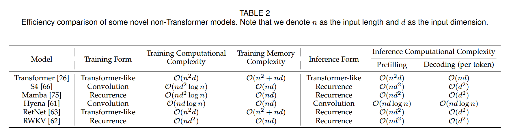

### Model Compression

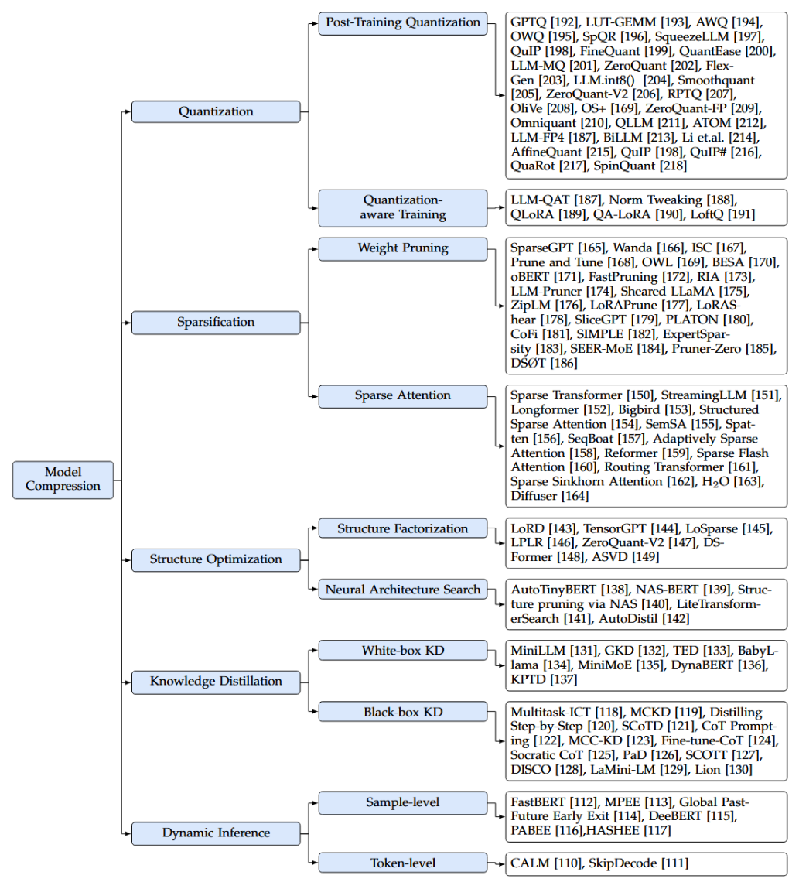

#### Quantization

Prefilling stage 计算开销大， GEMM 高精度 CUDA Cores

Decoding stage 内存访问开销大，载入大权重 tensor，Weight-only Quantization

##### Post-Training Quantization

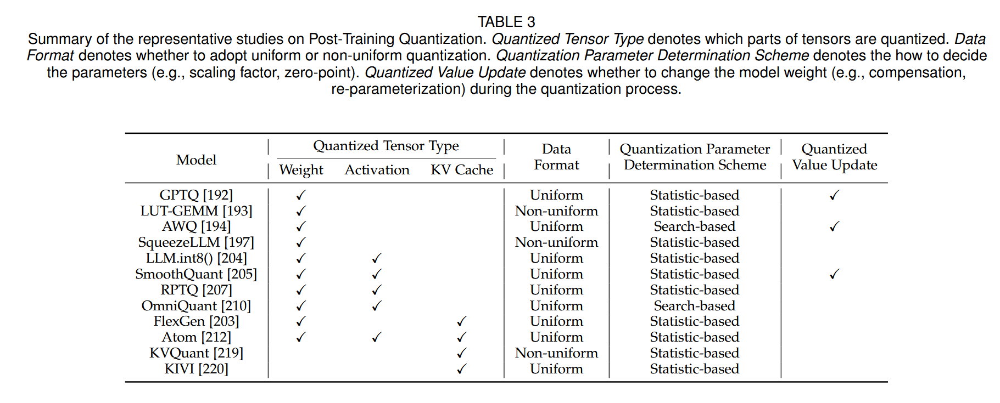

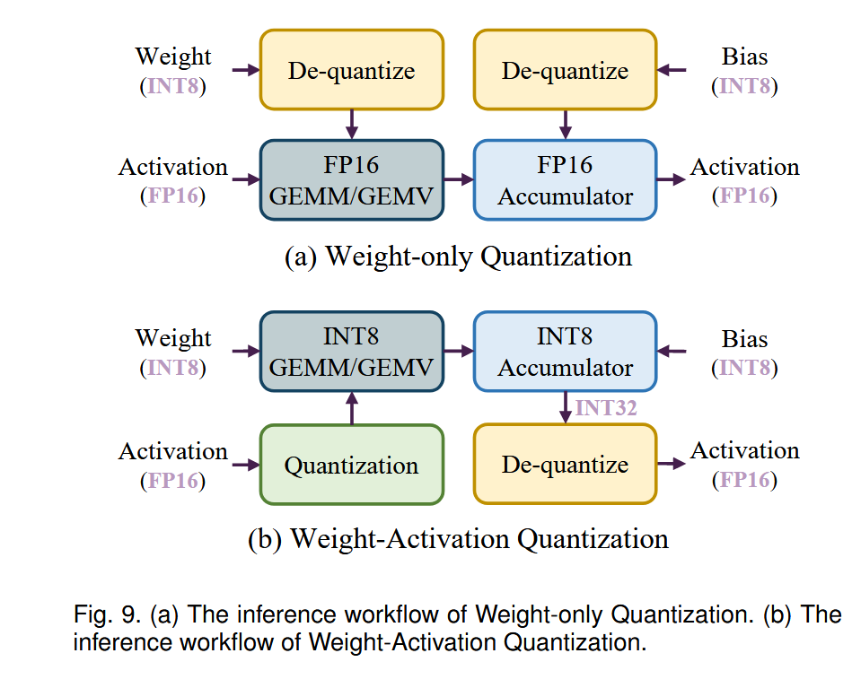

不再 retrain

Weight-Only Quantization，Quantizing both Weights and Activations，KV cache quantization。

Data Format Uniform or Non-uniform 是量化映射刻度平不平均

Quantization Parameter 确认方法

Quantized Value Update。

**weight-only quantization**

- 『Mark』GPTQ，LLM 量化的早期成果，基于传统量化 OBQ（对OBS的魔改，OBS由来自OBD）

  OBQ，行内根据原始的Hessian矩阵确认行内量化顺序，迭代调整未量化权重，计算补偿delta_q，Hessian 矩阵反复计算的复杂度高

  GPTQ，发现随机顺序效果也一样好，固定从左到右的顺序，重复利用海瑟矩阵的结果

- 『Mark』LUT-GEMM，提出反量化方式 Look-Up Table，降低反量化时的开销

  Binary-Coding Quantization (BCQ)，可学习的量化间隔

  （之前好像是在 flashinfer 代码中也见到过 LUT）

- 『Mark』AWQ，会更加保护少数的最重要的weight channel

- OWQ，对激活值的异常值，混合精度量化策略，对重要的采用高精度，不重要的低精度

- SpQR，权重异常值隔离处理量化，非异常的量化到3bit

- SqueezeLLM，异常值用全精度稀疏矩阵，并且用非均匀量化

- QuIP，LDLQ，二次代理目标

- FineQuant，启发式的方法并结合实验经验，确定column量化粒度

- QuantEase，基于GPTQ，用 Coordinate Descent 来提高精度，同时可以利用 GPTQ 的量化值来进一步提升

- LLM-MQ，Compressed Sparse Row (CSR) 存储异常值，层的位宽分配建模为整数规划，设计了高效Kernel反量化，降低了内存访问成本

- AffineQuant，等效仿射变换，降低量化误差

- Quip、Quip#、QuaRot（）、SpinQuant（在验证集中找 optimal 旋转矩阵） 通过计算不变性，旋转矩阵给权重、激活值矩阵，降低异常值

**Weight-Activation Quantization**

- ZeroQuant，细粒度量化（权重组量化、激活值token量化），算子融合，逐层知识蒸馏恢复性能

- FlexGen，量化 weight, KV cache，INT4

- LLM.int8()，激活值的异常值只有小部分channel，把激活值与权重分成两部分

- SmoothQuant，引入缩放因子，平衡权重与激活值的值，降低量化精度

- ZeroQuantV2，LoRC (Low-Rank Compensation)，用低秩矩阵降低量化误差

- RPTQ，不同激活值通道的分布差异大，重新组织簇cluster，分别簇内量化

- OliVe，牺牲普通值的精度，让量化的时候更关心异常值

- OS+，异常值分布集中、不对称，通道偏移和缩放

- ZeroQuant-FP，发现 W4A8，用 FP4, FP8 比整数更好

- Omniquant，优化权重裁剪边界和缩放参数，等效转换，减小量化误差

- QLLM，通道重组，可学习的低秩参数

- Atom，混合精度、动态量化，量化KV cache INT4，提高吞吐量

- LLM-FP4，预偏移指数偏差，结合激活值的缩放参数和权重

- BiLLM，权重的钟型分布和权重的海瑟矩阵的长尾分布，基于海瑟矩阵，权重分类重要和不重要

  二值化，1.08bit 的量化

- KVQuant，通过校准calibration集，对KV cache非均匀量化

- KIVI，per-channel K, per-token V，分组

『Mark』Evaluating Quantized Large Language Models，多个LLM-Quant的实验评估

##### Quantization-Aware Training

**减少数据需求**

-   LLM-QAT，无须额外数据，用分词表每个词元token起始生成句子，蒸馏训练量化LLM
-   Norm Tweaking，将起始词元token限制为最高比例语言的类别

**减少计算成本**

parameter-efficient tuning (PEFT)

-   QLoRA，把LLM权重 INT4 量化，再用 LoRA BF16 对每个 INT4 权重矩阵微调
-   QA-LoRA，观察到 QLoRA 量化参数和低秩适应器不平衡，分组量化，增加量化参数，同时支持将 LoRA 合并到对应矩阵中
-   LoftQ，QLoRA 从0初始化 LoRA 对下游任务不高效，提出用SVD奇异值分解（量化前后的差值的）初始化
-   Norm Tweaking，量化后再训练 LN，知识蒸馏匹配分布

##### Comparative Experiments and Analysis

Weight-Only Quantization 

1.   加速解码阶段，通过提升从 HBM 的加载数据的速度
2.   预填充阶段，实际可能会提高延迟，因为瓶颈在于计算开销，而非内存加载，还要增加反量化的开销
3.   随着 batch-size, input-length 提高，加速比降低，因为随着更大，计算的开销占比变大，同时WOQ降低了内存访问开销，计算开销就会更重要
4.   WOQ 对更大的模型收益更大

#### Sparsification

目的是降低**计算复杂度**和**内存占用**

##### Weight Pruning

**非结构化剪枝**

细粒度，更高程度的稀疏化，缺少高层次的规整性，不规整的内存访问和计算模式，硬件加速有限

剪枝标准，**权重重要性**和**剪枝率**；对很大的参数规模来说，**剪枝效率**也关键

基于重构损失的剪枝标准

-   SparseGPT，遵循 OBS (Optimal Brain Surgeon) 思想，考虑重构损失，采用最优部分更新 OPU 提高效率，设计了自适应掩码
-   Prune and Tune，基于SparseGPT，在剪枝过程中用最小步骤来微调
-   ISC，结合 OBS 和 OBD 的设计了新的剪枝标准，根据 Hessian 信息来分配非均匀的剪枝率
-   oBERT 和 FastPruning，利用损失函数的二阶信息来决定被剪枝的权重对象
-   BESA，重构损失的梯度下降，学习可微二元掩码，每层剪枝率由最小重构误差顺序决定

基于量级magnitude的剪枝标准

- Wanda，权重幅值与激活值范数逐元素点积作为标准

- RIA (Relative Importance and Activations)，用连接的权重来评价该权重的重要性

  将非结构化的模式，转化为结构化的N:M稀疏结构，在GPU上加速

其他剪枝标准和方法

- Pruner-Zero，自动识别LLM的最优剪枝度量，定制

- OWL，根据激活值的离群值比例分配每层的剪枝率

- DSØT，免训练的微调剪枝大模型的方式，

  『Mark』pruning-and-growing（Dynamic Sparse Training 中用的），先剪枝，再迭代调整网络拓扑结构

**结构化剪枝**

粗粒度，推理加速在传统硬件上

-   LLM-Prunner，根据连接关系判别耦合结构，再设计 组剪枝度量 决定剪枝，再可以通过LoRA等方式恢复性能
-   Sheared LLaMA，把原始的 LLM 剪枝成现存的预训练LLM，又设计了动态批量加载
-   ZipLM，迭代识别并剪枝结构化组件，权衡损失和运行时间
-   LoRAPrune，设计LoRA指导的剪枝标准，用LoRA的权重和梯度，迭代剪枝
-   LoRAShear，LoRA-based LLM，图论算法确定最小移出结构，结构性剪枝算法LHSPG，动态知识恢复
-   SliceGPT，RMSNorm 的计算不变性
-   PLATON，同时考虑权重的重要性（指数移动平均（EMA））和不确定性（上置信界（UCB））
-   CoFi 和 SIMPLE，学习相应的稀疏掩码来剪枝，再知识蒸馏
-   MoE 的专家剪枝
    -   ExpertSparsity，剪枝FFN，Frobenius范数量化，原始输出与剪枝层输出
    -   SEER-MOE，校准数据集上激活次数来量化重要性

##### Sparse Attention

MHSA，提高计算效率

**静态稀疏注意力**

常见稀疏模式

-   局部注意力，固定大小窗口注意力
-   全局注意力，减少解码阶段的内存访问成本和内存使用
-   随机注意力
-   扩张滑动窗口模式

-   Sparse Transformer，局部模式捕获局部上下文，然后每隔几个词使用全局模式聚合信息
-   StreamingLLM，应用局部模式，保留初始几个的注意力，attention sink
-   BigBird，局部、全局和随机模式的组合证明可封装所有连续序列，图灵完备性
-   LongFormer，扩张滑动窗口模式
-   Structured Sparse Attention，熵感知训练方法，让高概率的注意力更聚集，适应稀疏
-   SemSA，梯度的分析来识别重要的注意力模式，自动优化注意力密度分布

**动态稀疏注意力**

Dynamic Token Pruning

-   Spatten，注意力矩阵的列去评估重要性
-   SeqBoat，训练 SSM 决定head剪枝哪些词元
-   Adaptively Sparse Attention，生成过程中剪枝，对丢弃对未来不重要的上下文

Dynamic Attention Pruning

-   Bucket-based
    -   Reformer，局部敏感哈希，将哈希相同的k-v聚类到同一个桶
    -   Sparse Flash Attention，为hash-based稀疏注意力引入优化kernel
    -   Routing Transformer，球面k均值聚类，优化选择过程
    -   Sparse Sinkhorn Attention，排序网络，对齐 k 和 q buckets，只做对应的运算
-   H2O，词元级别，静态局部注意力与当前查询和动态识别的关键词元的动态运算，生成中移除最不重要键的

图论

-   每个词元视为图节点，原始完全注意力等同完全图，随机掩码的稀疏注意力等同于任意两点距离 log n
-   『Mark』Diffuser，图论的视角，多跳词元相关性扩展感受野，扩展图，设计近似注意力信息流

#### Stucture Optimization

平衡模型效率和表现

##### Neural Architecture Search

-   AutoTinyBERT，one-shot NAS，找Transformer的超参数，引入批量训练方法训练SuperPLM，进化算法来识别最优的子模型
-   NAS-BERT，分块搜索、搜索空间剪枝和性能近似等技术，有效地应用于各种下游任务，无须大量重训练
-   NAS，结构性剪枝
-   LiteTransformerSearch，免训练的指标，如参数数量
-   AutoDistil，搜索空间划分、任务不可知的SuperLM训练和任务不可知的搜索，促进各种跨任务的架构搜索

##### Low Rank Factorization

用两个低秩矩阵来近似，减少内存使用并提高计算效率，因为内存访问成本是解码速度的瓶颈，LRF减少需要加载的参数数量

-   LoRD，用奇异值分解 (SVD) 来分解权重矩阵
-   TensorGPT，张量训练分解 (Tensor-Train Decomposition)压缩嵌入层，token视为矩阵乘积态 (MPS)，提高分布式计算效率
-   LoSparse，LRF和权重剪枝，减轻直接模型剪枝通常会发生的丢失过多表达性神经元的风险
-   LPLR 和 ZeroQuant-V2，同时应用LRF和量化来压缩权重矩阵
-   DSFormer，权重矩阵分解为一个半结构化稀疏矩阵和一个小密集矩阵的乘积
-   ASVD，激活感知的SVD，根据激活分布缩放权重矩阵，搜索过程确定每层的适当截断秩
-   SVD-LLM，截断感知的白化技术识别移出后影响最小的奇异值

#### Knowledge Distillation

可以接触到结构与参数，中间的特征与输出logits

##### White-box KD.

-   MiniLLM，标准白盒KD，但用 reverse KLD 代替 KL
-   GKD，引入策略数据，包括学生模型的输出，进一步对齐师生模型
-   『？』TED，任务感知的逐层KD，每一层后加filter，固定教师filter训练学生，效果上是把和下游任务相关的KD出来
-   MiniMoE，用MoE作为学生模型
-   DynaBERT，逐步减少模型宽度、深度
-   KPTD，基于实体定义生成一个迁移集

##### Black-box KD.

教师模型的结构和参数不可用的KD

**上下文学习 (ICL) 能力蒸馏**

-   『Mark』Multitask-ICT，引入了上下文学习蒸馏，转移 few-shot 的能力
-   『Mark』MCKD，多阶段蒸馏范式

**思维链 (CoT) 推理能力蒸馏**

- Distilling Step-by-Step, SCOTD, CoT Prompting, MCC-KD 和 Fine-tune-CoT，结合回答与原因来训练

- Socratic CoT，推理能力迁移，微调一对模型，问题生成QG与问题回答QA

  QG被训练来根据输入问题生成中间问题，QA生成最终回答

- PaD，根据错误的推理信息有害，额外增加解释器检查，移出含错误推理的蒸馏数据

**指令遵循 (IF) 能力蒸馏**

-   DISCO，使用LLM生成短语扰动，然后由教师模型过滤，蒸馏
-   LaMini-LM，设计一个多样化的指令集，转移指令能力
-   Lion，教师模型识别困难的指令，并生成新的复杂指令给学生模型

#### Dynamic Inference

和 MoE 不同，DI 是提前退出

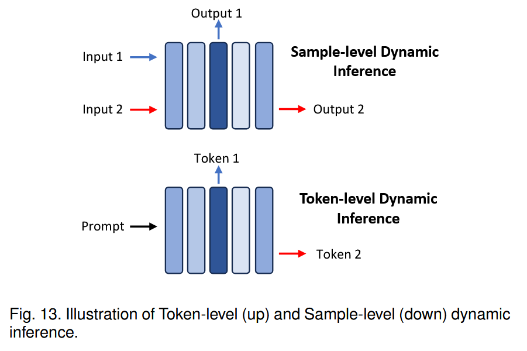

##### Sample-level.

-   FastBERT, DeeBERT, MP 和 MPEE，根据特征训练退出分类器
-   Global Past-Future Early Exit，用前后层的信息来丰富模块输入
-   PABEE，训练成预测的输出头
-   HASHEE，无参数判断，相似样本，相同层退出

##### Token-level.

- CALM，Transformer层之后退出分类器，缺失的 KV cache，直接复制退出层的特征，性能下降轻微

- SkipDecode，提前退出会导致批量推理和KV cache的局限，限制实际的加速

  提出统一的退出点，退出点单调递减，使得KV cache不用重算

### Knowledge, Suggestions and Future Direction

- non-Transformer 架构，Mamba，RWKV 以及变体

- 模型压缩，量化是主要方法，应用方便，大量减少内存消耗与提高推理速度，对应于很小的性能降低

  但可能会损害如自我纠正、多步推理等能力

  比如长上下文场景，可能就会有较大影响了

- 对高效长上下文，稀疏注意力是主要研究技术

  但是丢失掉重要信息的话，对性能影响很大，即使稀疏度不高

  所以，模型权重剪枝仍然关键

- 模型结构优化，NAS，但需要大量的计算资源

  自动优化可行性仍在探索

  LRF等技术在压缩率与性能之间的权衡

## System-Level

### Inference Engine

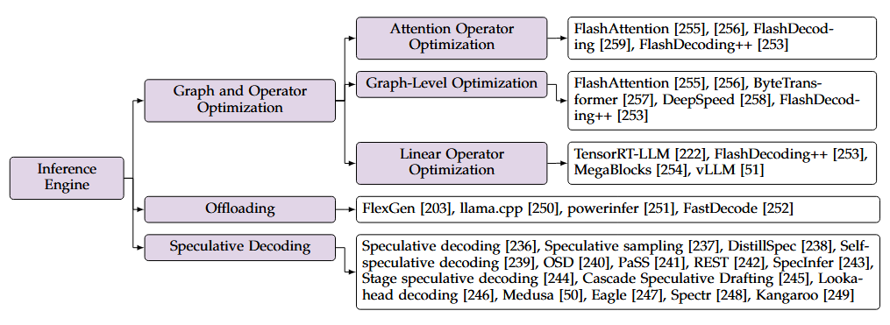

#### Graph and Operator Optimization

##### Attention Operator Optimization

- 『Mark』FlashAttention，缓解内存访问等开销

  融合成单独一个算子，缓解内存访问开销，注意力矩阵分成多个块，消除完整载入的需要

- 『Mark』FlashDecoding，最大化decoding阶段的计算并行

  decoding阶段，Q矩阵是batch of vectors

  并行度如果是 Batch size 维度会受限，他以**序列维度来并行**

  虽然引入了在softmax阶段的同步开销，提升依旧明显，特别是batch小，seq大的时候

- 『Mark』FlashDecoding++，之前的工作的最大值只作为防止溢出的作用，但动态最大值也带来了很大的同步开销

  大量实验证明，softmax的输入落在特定的范围

  提出提前确定缩放因子，消除了softmax的同步开销

##### Linear Operator Optimization

- TensorRT-LLM，引入 General Matrix-Vector Multiplication (GEMV)

- FlashDecoding++，引入FlatGEMM概念，表示维度缩减的GEMM ( < 8)

  低并行度（细粒度分块策略）、内存访问瓶颈（双缓冲技术）

  观察到线性算子在特定的LLM常常形状一致，提出启发式的选择策略

  根据输入的形状，选用 FastGEMV, FlatGEMM, GEMM (cuBLAS)

- 『Mark』MegaBlocks，首先去优化 MoE FFN 的，linear operator 可以占据九成

  提出的定制 GPU Kernel 主要对于训练阶段，对推理阶段没有

  vLLM 目前集成 Triton 的 fused kernel，削除索引开销

##### Graph-Level Optimization

Kernel fusion 为代表，降低内存访问，kernel启动开销，增加并行度

- FlashAttention，将注意力算子融合成一个内核（注意力算子的 memory-bounded 的）

- ByteTransformer 和 DeepSpeed，融合轻量级算子，残差添加、层归一化和激活函数等融合到前面的线性算子中

  减少 kernel launch 开销

- 对 LLM 推理来说，QKV 投影融合到一个线性算子中，

#### Speculative Decoding

小模型作为草稿模型，目标模型作为验证模型

草稿构建，草稿验证，接受率是关键指标，确保输出与自回归（贪婪采样 概率最高，或核采样 按概率）等效

因为核采样多样性，用 speculative sampling 保持输出分布，生成按概率接受

变体 token tree verifier，树状表示，树注意力机制做高效验证

接受率与两者输出的分布直接相关

- DistillSpec，从目标LLM直接蒸馏小的草稿模型

- SSD (Self-speculative Decoding)，自动识别目标模型的子模块，无需单独训练草稿模型

- 『Mark』OSD (Online Speculative Decoding)，动态调整草稿模型的输出分布以匹配用户查询分布

  用拒绝的草稿词元来微调模型

- 『Mark』PaSS，目标LLM本身作为草稿模型，在输入序列中加入可训练的“前瞻词元”

- REST，基于检索，使用非参数检索数据存储作为草稿模型

- 『Mark』SpecInfer，用 boost-tuning 使得一组的草稿模型的输出和目标LLM对齐

- Lookahead decoding，生成 n-grams，辅助生成草稿词元

- 『Mark』Medusa，微调一些注意力头来生成 draft token

- Eagle，轻量级Transformer层以自回归方式生成草稿词元，输入结合丰富的目标LLM的上下文

- Kangaroo，用固定浅层子网络作为draft model，训练轻量适应器，不用额外训另一个draft model

**草稿构建策略**

传统方式只有一个候选序列，如果有一个token是不满足的，后续都会被放弃，验证通过率低

-   『Mark』Spectr 和 SpecInfer，生成多个草稿词元序列，同时用 token tree verifier 验证
-   Stage Speculative Decoding 和 Cascade Speculative Drafting (CS Drafting)，推测解码集成到词元生成过程中，加速草稿构建

**Comparative Experiments and Analysis**

-   Eagle 加速明显
    1.   自回归生成 draft token 可以利用前面的生成的 token
    2.   从先前的目标 LLM 和 草稿模型的 token，集成了丰富的特征
-   token tree verifier 高效推测解码
-   端到端加速比低于接受率，生成草稿的代价不可忽视

#### Offloading

- FlexGen支持卸载权重、激活和KV缓存，并将卸载问题公式化为图遍历问题以最大化吞吐量 。

  下一批数据的加载和前一批数据的存储可以与当前批的计算重叠 。

- llama.cpp，也将计算任务分配给CPU，以低功耗CPU的计算成本为代价减轻数据传输开销 。

- Powerinfer，利用LLM中ReLU激活的稀疏性，将激活分为冷热神经元子集

  冷神经元被卸载到CPU进行存储和计算

  利用自适应预测器和稀疏算子显著提高了带卸载的计算效率

- FastDecode，将整个注意力算子的存储和计算卸载到CPU

  因为在 CPU 上运算，KV cache 的数据移动减少到仅一些激活值，CPU数量以匹配GPU上的工作负载延迟，减小异构流水线气泡

### Serving System

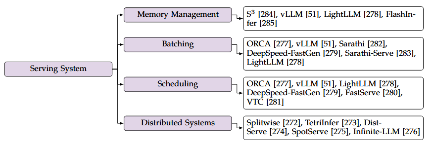

提高异步请求效率

内存管理，容纳更多请求，批处理和调度策略以增强系统吞吐量，分布式计算资源

#### Memory Management

生成长度不定，kv cache 分配

- 早期实现，预设最大长度；若结束的早，造成存储资源浪费

- S3，预测每个请求的上限，减少浪费，但如果不存在这么大的连续空间，静态分配会失败

- 『Mark』vLLM，解决碎片化存储，提出页式存储管理，先申请尽可能大的内存，然后再等分成若干个物理块

  对请求动态映射预申请的物理块，提高了吞吐量

- LightLLM，基于vLLM，更细粒度的存储，减少由于不规则的浪费，把一个token作为一个单元

这种 paged 但是会导致注意力算子的不规则内存访问，为了高效注意力算子，需要定制kv cache的访问方式，来连续内存访问

vLLM 的 PagedAttn K缓存的头大小维度存储为16字节连续向量，FlashInfer 编排了不同的数据布局

#### Continuous Batching

一个批次的请求长度不同，长度短的结束早

由于服务场景的请求异步性，CB 一些旧请求完成后立即批处理新请求

- 『Mark』ORCA，首次 LLM 中用连续批处理

  不同请求在 iteration-level batching，在线性算子，序列维度连接

- vLLM，拓展到注意力算子，不同 kv cache 长度

- Sarathi, DeepSpeed-FastGen 和 SarathiServe，LightLLM，**split-and-fuse**，把 prefill 与 decoding 一起批处理

  序列维度上分割长的 prefill，和多个短的 decode 放一起，平衡不同迭代的负载

  消除新请求的停顿

  split-and-fuse，前提是 prefill 可以被分成离散块

- Chunked-prefill，利用自回归特性，有数学等价性，减少请求延迟

#### Scheduling Strategy

请求执行顺序影响吞吐量，head-of-line blocking，第一个请求很大，包括对内存的占用

- ORCA, vLLM, LightLLM，first-come-first-serve (FCFS)

- DeepSpeed-FastGen，优先处理解码请求

- FastServe，preemptive scheduling 抢占式调度，实现低 JCT 作业完成时间

  multi-level feedback queue (MLFQ) 多级反馈序列，优先剩余时间最少的

  因为 decoding 长度未知，预测长度，skip-join 找到适合的优先级

- VTC，LLM 服务的公平性，基于 token 数量的 cost，确保公平性

#### Distributed Systems

增加吞吐量

-   splitwise, TetriInfer 和 DistServe，解耦 request 的 prefill 和 decode，能够按照对应特性各自处理
-   ExeGPT 和 Llumnix，实时排序，负载均衡、碎片整理和优先级排序
-   SpotServe，云上可抢占GPU式的服务，解决动态并行控制、实例迁移、token-level state recovery
-   『？』Infinite-LLM，跨数据中心并行化注意力算子中序列的不同部分
-   LoongServe，弹性序列并行性，管理迭代级别的弹性资源，调度减少 kv cache 移动

### Hardware Accelerator Design

- FACT，混合精度量化，算法-硬件协同设计，但没有针对LLM设计

- ALLO，FPGA 在内存密集的 decode 阶段的优势，强调模型压缩对 LLM 在 FPGA 上的部署的重要性

  高级综合库 HLS

- DFX，decoding 优化，缺乏模型压缩，限制了模型参数、长输入

- FlightLLM，可配置的稀疏数字信号处理 DSP 链

  混合精度支持的 always-on-chip decode 方案

### Comparison of LLM Frameworks

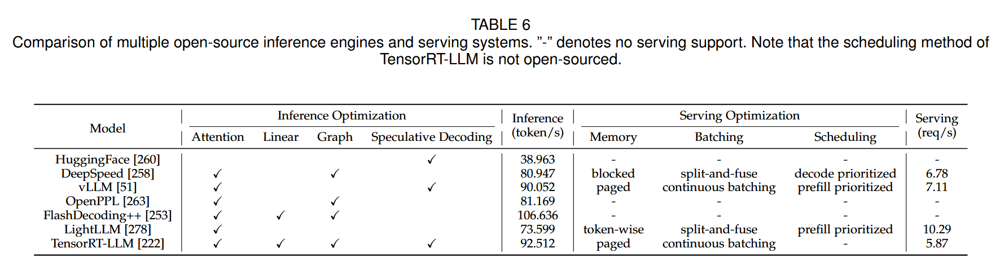

### Knowledge, Suggestions and Future Direction

算子优化和服务场景结合紧密，算子优化会因需求场景而特殊设计

长度不确定，常用预测，但是目前预测效果一般