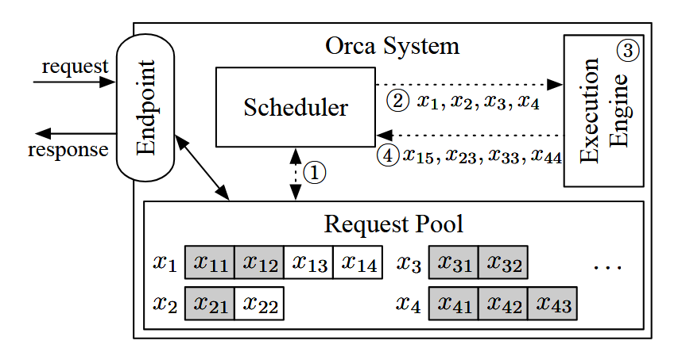
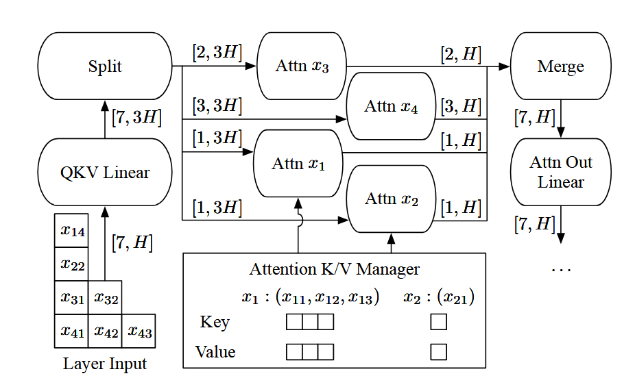

# Orca: A Distributed Serving System for Transformer-Based Generative Models

[论文地址](https://www.usenix.org/system/files/osdi22-yu.pdf)

Continuous Batch

## 动机与贡献

1. Early-finished and late-joining requests

   - 问题：

     现有的推理服务系统以 request 为粒度调度，一个批次完整结束才能处理后面的 request。

     较短生成的 request 要等较长生成的 request。

     （展示了request 同 input 长度，如果 input 长度不同是什么样的？）

     训练不存在这个问题，因为用 Teacher Forcing technique，只要一次迭代就完成了

   - 解决方案：Iteration-level scheduling

     调度粒度 iteration-level，调度器获得控制在一次迭代中，多少、哪些请求被处理

     暴露一个 endpoint 终端节点，来接受请求和返回回答

     用 Request Pool 来管理所有的请求

     Scheduler 来选择 request set，调用 Execution Engine，接受运行结果，用运行结果更新 Request Pool

     

2. Batching an arbitrary set of requests

   - 问题：

     initiation phase 开始阶段，token 数量不同不能 batching

     increment phase 增量阶段，不同索引（kv cache）不能 batching

     不同阶段不能 batching（开始阶段输入所有 input token，增量阶段输入一个 token）

     

     batching 条件苛刻，实际情况的负载难以符合，长度越长，越难

     （传统的批处理具体是怎么样的？一个 batch 里面分别访问各自的 kv cache，长短不一 padding 代码实现方式）

   - 解决方案：Selective batching

     不选择对所有算子使用 batching 处理

     不能 batching 的原因是输入的形状不规则，但是不是所有的算子都不能适配不规则的算子

     比如 Linear, LayerNorm, Add, and GeLU

     selective 指对算子的选择，分为可接受输入形状不规则和不可接受

     注意力算子，是采用 Split、单独计算、Merge 的方式，用 Attention K/V Manager 为每个请求单独管理 kv cache

     

## Orca Design

- 分布式结构

  要支持 scale up 的参数，需要考虑分布式结构的设计

  intra-layer 和 inter-layer 并行（最初用于训练的技术）

  把CPU-GPU的**控制信息**和**数据信息**分开传输，数据信息使用 NCCL，GPU-GPU 传输，gRPC 是 CPU-CPU传输

  之前的分布式推理，控制信息和数据信息一起传 CPU1 => GPU1 => GPU2 =等待=> CPU2

  会出现 CPU-GPU 同步开销，而且每一次迭代都有，那就不可忽视，分开传输后，消除了这部分气泡

  让 GPU 尽可能工作

- 调度算法

  调度器每次迭代都会决策

  ORCA 的策略是 FCFS 先到先服务

  考量因素：

  1. 以**延迟增加**为代价，为**吞吐量**增加**批次大小**；当**批次大小**过大后，**吞吐量**会减小，需要设置好**批次大小**

  2. GPU 内存限制，通过**重用 buffer 缓冲**的方式优化内存使用，但在注意力 kv cache 的重用中，只有当请求结束才会释放整个的缓冲，如果实现过于朴素，会因为没有足够内存而形成**死锁**，需要设置好**预留内存**

     具体地，用请求中的 max_token 去累加预留内存

  对于外部的请求接受与返回，会有并发线程去插入或删除 request_pool 请求池内的请求

从流水并行上比较，ORCA 的方式为流水并行无需额外代价，FasterTransformer 的方式，需要用微批次来权衡流水并行度，同时可能会产生气泡，而微批次又会损害批处理的表现。

## 实现与实验

gRPC - control plane, NCCL - data plane

fused kernel，包括 split Attn（虽然因为运行时间不一致，但是总的来说提高了 GPU 的利用率，同时减小内核启动开销）

（为什么 inter- 和 intra- 结合？intra- **通信成本**高；**扩展性**有限，如注意力层，不能超过注意力头）

测试场景，因为本文提出两大方面的改进，分布式架构的控制信息与数据信息的分离，是单独对 execution engine 影响的，所以设计了单独 ORCA engine 和 end-to-end 场景的实验。

具体地，在 Orca engine  基准测试中，一直给定相同的 batch 来模拟 request-level 的调度

端到端测试中，没有真实的 request 模型和数据，无法知道正确的中断位置，设置不产生 \<EOS\>，生成到 max_token

模型，只是因为当时没有合适的开源大模型，他们就根据 GPT3 公布的结构来模拟搭了一个，没有训练，只有结构

（所以，会不会存在参数设置，然后产生一些优化？不过因为基准测试用的是同一个模型，应该影响不大）

数据，人工合成符合统计分布的数据：输入输出长度，随机抽样；到达实现 Possion泊松分布，同时调整参数，来表示不同的负载情况。

（现在有 publicly-available request trace for generative language models 的数据了么？不过为了能更加好的定量测量比较可能还是会去设置固定的生成长度什么的吧

**ShareGPT** and **Alpaca** datasets，not include timestamps）

注意力操作选用狭义定义，**缩放点积注意力（scaled dot-product attention）**部分，即 `softmax(Q @ K.T) @ V`，是激活值之间。

没有 batching reuse 参数，影响不大，因为没有参数

作者通过精细的设计实验，使得每一模块的设计，都能去单独比较。

Orca Engine（排除调度优化）

>   层内并行的 GPU，控制信息会一次分发到，因为他们本身就要一起工作，层间并行对 GPU，因为会等上一层的结果，如果不用 gRPC 来传递控制信息，用 NCCL 传递，就会有 CPU-GPU 同步的问题

小模型（排除 gPRC 控制信息优化）

由于不是所有的算子都去 batching，所以执行时间会高一点点，因为（狭义）注意力算子没有参数重用，影响不大。

但是 batch size 大小上，Orca 能支持的大小更大，因为 FasterTransformer 固定了 max_token，而 Orca 可以根据每个请求各自的 max_token 来设置预留空间，支持更多的场景，扩展性更好。

大模型（考虑 gPRC 控制信息优化）

（禁用流水优化，因为 Iterative-level 的流水优化比 mircobatch 的方式，天然好，且不需要 tradeoff 微批次大小和并行性）

有层间并行，运行时间上明显下降，最好高比 FasterTransformer 好 47%

同时，更多层间，优化效率类似。

end-to-end（包括调度优化）

更改负载，画图（生成数据的参数）

对 FastTransformer 来说，直接批次比微批次性能更好，但是 BS 太大，会加剧 early-finished 和 late-joining requests 问题

## 相关工作

- Fine-grained batching for recurrent models

  『Mark』BatchMaker (Low latency RNN inference with cellular batching)，以 RNN cell 为粒度来调度和批次

  每次 RNN cell 执行的是一样的运算，而 Transformer 要复杂得多，且没有对大模型和流水线并行的支持

- 相比之前的运行引擎，大多数只是作为后端，并且还没有很多支持分布运行的

- 相比之前的服务系统，往往和运行引擎是非耦合的，Orca 耦合度增加，包括更频繁的交互，管理内存，一体化等。

## 总结

从现有的 request-level batching 不足出发，提出更加细粒度的调度 iteration-level。

在构想时，发现有些算子不能接受不规则的输入，用 selective batching 解决，注意力算子用 split-merge + fuse 处理。

具体地，为了能够支持大模型的运行，execution engine 使用分布式架构，同时对通信方式进行改进，

使用 gRPC 在 CPU 线程之间传输控制信息，NCCL 在 GPU 之间传输数据，消除了层间 NCCL 传输控制信息的 CPU-GPU 同步的气泡。

因为 serving system 和 execution engine 耦合的更深了，所以调度算法需要考虑的粒度也要更细。

## 优化思路

把 serving system 的调度粒度从 request 变成 iteration，tradeoff 了个别算子（注意力算子）的 batching 的效率，和 execution engine 的耦合度。

控制信息和数据信息，分开传输。

## 未来可能方向

保持低耦合的形式，细粒度的调度

定制注意力算子，支持不规则的 batching

自动找寻最后批次大小、并行参数

调整优先级，优化 FCFS，保证 fair 的基础上，进一步优化 batching 的对象

## 源码阅读

[他人复现](https://github.com/LLM-Systems-Research/orca)

（待）