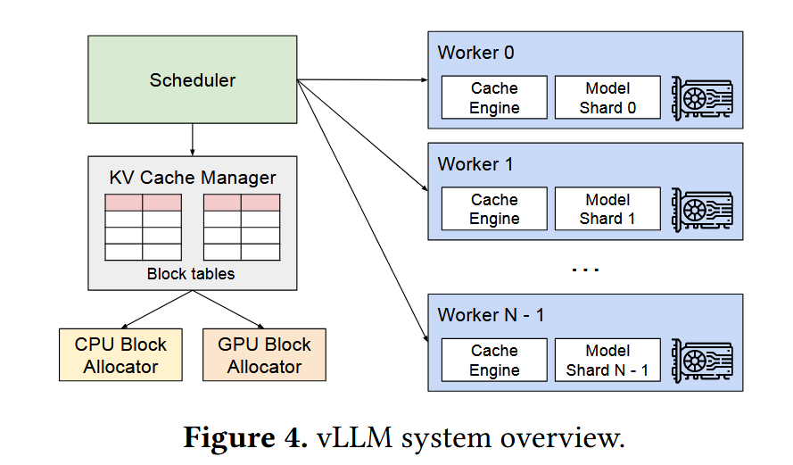

# Efficient Memory Management for Large Language Model Serving with PagedAttention

[论文地址](https://arxiv.org/abs/2309.06180)

## 动机

KV Cache 在 LLM 中占比大，现在的 serving system 的内存管理会存在很多内部碎片、外部碎片，内存浪费，不能充分利用内存去做 batching。

现存系统不能很好的利用 memory sharing，共享前缀等。

## 贡献

-   由虚拟内存、分页技术启发，提出 PagedAttention，在逻辑上连续，物理存储上不连续的块上计算注意力
-   以 PagedAttention 为核心，设计实现了 vLLM，分布式服务引擎

## vLLM Design

- PagedAttention 算子

- KV Cache Manager，把逻辑连续的块，映射到物理不连续的块上，维护块表，使得不需要一次就申请所有位置的内存

- 多种场景的 decoding（Parallel sampling、Beam search、Shared prefix、Mixed...），引入 reference count，类似于操作系统的虚拟内存的 copy-on-write

- 调度，FCFS；由于没有关于生成长度的先验，边生成边申请，会遇到内存耗尽的情况。

  提出启发式的选择预计会**最晚访问**的块放逐，同时考虑到 LLM 的特性，使用 **all-or-nothing** 的放逐策略，对于 Beam，采用 gang-schedule 一起放逐（同样是考虑到 LLM 的特性，要么全要用，要么全不用）

  停止接收请求，等到能放回来之后，把放逐的块完成了后，才继续接收（能够预留足够内存，防止 trashing 颠簸）

  具体放逐的方式（取决于内存带宽和计算效率，包括长度，优势不同）

  -   Swapping，换到 CPU 内存中
  -   Recomputation，重计算

- 分布式执行，为了避免 GPU worker 需要多次和 memory manager 同步，设计 centralized scheduler，GPU worker 之间 all-reduce

## 实现与实验

-   vLLM，FastAPI 前端，GPU-based 推理后端
-   实现很多为了加快块的读写、复制的 fused Kernel，**fused reshape and block write**, **fusing block read and attention**, **fused block copy**.
-   为了支持多种 decoding 算法，实现三种关键方法，**fork**, **append**, **free**

-   提出的方法和 Orca（continuous batching）是正交、互补的。
-   在越长、越复杂的 decoding 场景效率提升越明显

消融实验

-   Kernel Microbenchmark，新引入了块的概念，在访问 block table, block 读写开销等方面会引入延迟，具体地，基本只影响 attention 部分，开销不大
-   Block size 的选择，小浪费GPU并行资源，大浪费内部内存碎片
-   重计算和交换的比较

## 优化思路

引入 OS 的虚拟内存、页表的思想，管理 KV cache

## 未来可能方向

自动寻找最优块大小

动态选择重计算或交换内存

## 源码阅读

[vLLM](https://github.com/vllm-project/vllm)

[具体代码学习](vLLM.md)

